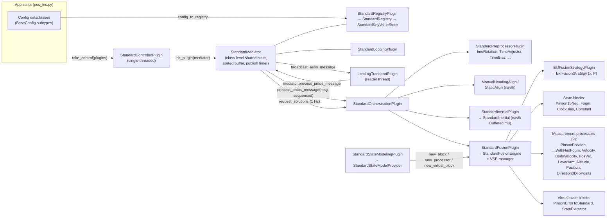

# Cobra (pntOS reference implementation) — Analysis for a C++ Rewrite

Date: 2026-10-02
Source: https://github.com/is4s/Cobra @ a23e595 (cloned to `~/orin/work/pntos/Cobra`)
Companion upstream repos inspected (read-only, in scratch): `Open-PNT/pntOS-C` (canonical C API headers),
`is4s/NavToolkit` (C++ nav library behind the `navtk` Python module), `is4s/aspn-generated` (ASPN-23 message
definitions in C, C++, Python, LCM, ROS, DDS).

---

## 1. Executive summary

Cobra is IS4S's pure-Python reference implementation of **pntOS**, a plugin architecture for Position, Navigation
and Timing (PNT) sensor fusion. It is ~42k lines of Python (21k of which are the plugin implementations, 4.5k the API,
12k tests, the rest apps/docs/tooling). Everything that flows between plugins is an **ASPN-23** message
(a standardized navigation message set) wrapped in a `Message{wrapped_message, source_identifier}`.

The reference app is a loosely-coupled **GPS + IMU error-state EKF**: an IMU is mechanized by NavToolkit (C++),
a 15-state Pinson error model is propagated between GPS fixes, GPS position updates correct the error states,
and the corrections are fed back into the inertial. Everything is wired at runtime from Python dataclass config.

**What I verified on this machine (x86_64, Python 3.12, 22 cores):**

| Check | Result |
|---|---|
| Install (`pip install -r requirements.txt`) | OK, ~3 min incl. 474 MB example dataset |
| Unit tests (`pytest pntos-cobra`) | **366 passed, 1 failed, 1 skipped** in 4 s. The failure is environmental (geoid grid file lookup, see §12). |
| End-to-end app `standard/pos_ins.py` on the 43-minute example log | **PASS** against truth-error bounds (36.6 s wall) |
| Dummy minimal app | runs and shuts down cleanly |
| Full app matrix (13 log-replay apps) | **13 passed** in 11 min (§14) |
| CPU profile of pos_ins | 37.8 s CPU for 2592 s of data; ~26 % inside navtk C++ mechanization, the rest is Python overhead |
| `ruff check`, `ruff format --diff`, `ty check` | all clean (240 files) — the codebase is well-typed, which simplifies translation |

**Key findings for the rewrite**

1. There is already a **canonical C API** (`pntOS-C`, 4k lines of headers, `PNTOS_PLUGIN_API_VERSION 2`). Cobra's
   Python API is kept in lock-step with it by CI (`util/api_synchronization/compare_apis.py`). A C++ port should
   target that ABI (or at minimum mirror it 1:1), which gives interoperability with the pntOS loader and other
   language implementations for free.
2. The heavy numerical lifting that Cobra *delegates* already exists in C++: NavToolkit (mechanization, alignment,
   earth model, nav math; C++20, meson, xtensor) and aspn-generated (ASPN structs with Eigen/xtensor/STL variants plus
   LCM C++ bindings). The Python layer spends measurable time just converting between the Python and C++ structs.
3. The parts that must be *written* in C++ are well bounded: the controller/mediator, registry, EKF strategy, fusion
   engine (block bookkeeping + virtual state blocks), 4 state blocks, 9 measurement processors, 2 virtual state
   blocks, 6 preprocessors, 2 alignment wrappers, inertial wrapper, LCM log/network transports, logging, and the
   config convention. Roughly 9–10k lines of Python core logic (excluding UI, ROS, tutorials, docs).
4. One genuine latent numerical bug was found and reproduced (Pinson15 process-noise matrix mutated in place, §12).
   Several API/implementation mismatches are listed in §12; the port should decide deliberately on each.

---

## 2. What was run, and how (reproducible)

```bash
cd ~/orin/work/pntos/Cobra
python3 -m venv .venv && .venv/bin/pip install -r requirements.txt       # ~3 min
.venv/bin/python util/test_installation.py                                 # "Installation successful!"
.venv/bin/python -m pytest pntos-cobra -q                                  # 366 passed, 1 failed (geoid), 1 skipped (ROS)
.venv/bin/python -m pytest pntos-cobra-apps -k test_standard_pos_ins_app -s  # 1 passed in 36.6 s
timeout 20 .venv/bin/python pntos-cobra-apps/src/pntos/apps/dummy/minimal.py
```

Error statistics of the pos_ins run versus the truth INS channel (`/sensor/ins-d/pva`), computed by the same
math the integration test uses (script kept at scratch `error_stats.py`):

| | N | E | D |
|---|---|---|---|
| **Position** RMS err [m] | 0.92 | 1.24 | 1.67 |
| Position max abs err [m] | 2.86 | 2.87 | 3.76 |
| Position mean 1σ [m] | 1.60 | 1.57 | 2.05 |
| Position % inside 1σ / 2σ / 3σ | 91.6 / 99.8 / 99.9 | 78.7 / 100 / 100 | 75.0 / 100 / 100 |
| **Velocity** RMS err [m/s] | 0.084 | 0.093 | 0.043 |
| Velocity max abs err [m/s] | 0.74 | 0.63 | 0.26 |
| **Tilt** RMS err [deg] | 0.074 | 0.092 | 0.811 (heading) |
| Tilt max abs err [deg] | 0.37 | 0.46 | 3.40 |

2,570 solution epochs at 1 Hz, from t = 10.1 s (after a 10 s static alignment) to t = 2601.8 s. 260k IMU
messages at 100 Hz and ~2.6k GPS positions at 1 Hz were processed. The integration test asserts
`std < 1.4 m / 0.1 m/s / 0.81°`, `max < 3.8 m / 0.8 m/s / 3.5°` and minimum percent-within-sigma bounds;
**this table is the acceptance baseline the C++ port must reproduce.**

> **C++ port result (2026-10-03):** `apps/standard/pos_ins` on the same log gives position RMS 0.917 / 1.233 /
> 1.668 m, velocity RMS 0.0850 / 0.0939 / 0.0423 m/s, 2572 epochs, 2.1 s wall (`tools/compare_to_truth.py`;
> see `docs/DESIGN.md` §9.5).

---

## 3. Repository layout

```
Cobra/
├── pntos-cobra-api/     pure-Python API spec (ABCs) — 4.5k lines, mirrors pntOS-C headers
├── pntos-cobra/         plugin implementations + config + utils + 367 tests — 21k + 12k lines
│   └── src/pntos/cobra/{standard_plugins, dummy_plugins, tutorial_plugins, advanced_plugins, extras, config, utils}
├── pntos-cobra-apps/    runnable apps (dummy, tutorial, standard×9, extras, advanced ui/ros) + integration_test.py
├── docs/                Sphinx/MyST docs (very good: introduction, concurrency, config, plugin pages)
├── util/                api sync (clang-based), app-sync patches, check scripts
└── postprocessing/      plotting / run-and-record helpers
```

Three pip packages: `pntos-cobra-api` (2.0.0), `pntos-cobra` (2.0.0), `pntos-cobra-apps`; meta package `cobra 2.1.0-dev`.
Toolchain: ruff, ty (type checker), pytest, uv; CI runs on Py 3.10 and 3.14, Windows, and ROS Jazzy.

---

## 4. Architecture

### 4.1 Plugin taxonomy (the API)

Fourteen plugin kinds, all deriving from `CommonPlugin{identifier, init_plugin(resources, mediator), shutdown_plugin()}`:

| Plugin | Role | Factory for |
|---|---|---|
| **Controller** | "main()": owns concurrency model, creates the Mediator, wires everything | — |
| **Transport** | bridges a wire/log (LCM, ROS, dummy) ↔ ASPN `Message`s; `start/stop_listening`, `broadcast_message` | — |
| **Orchestration** | receives (optionally time-sorted) messages, runs the filter, answers `request_solutions` | — |
| **Registry** | group→key→value store; config + runtime side-channel + observers | `Registry` → `KeyValueStore` |
| **Logging** | sink for `log(plugin_type, id, level, msg)` | — |
| **Fusion** | `StandardFusionEngine`: block bookkeeping, big Φ/Q/H assembly, VSB routing | `StandardFusionEngine` |
| **FusionStrategy** | numerical filter core (EKF): `add/remove_states, propagate(Φ,Qd,g), update(z,h,H,R)` | `StandardFusionStrategy` |
| **StateModeling** | factory-of-factories: provides `StateBlock`s, `MeasurementProcessor`s, `VirtualStateBlock`s | `StandardStateModelProvider` |
| **Inertial** | IMU mechanization with time history, resets, bias correction | `StandardInertialMechanization` |
| **Initialization** | alignment strategies (static gyrocompass, manual heading, PVA message, dynamic) | `InertialInitializationStrategy` |
| **Preprocessor** | per-channel message transforms before the filter (rotate IMU, time fixes, downsample, outage, baro→alt) | `Preprocessor` |
| **UI** | dev GUI hook (`requires_main_thread`, `run_main_thread`) | — |
| **PlatformIntegration** | platform-specific control (unstable; not used by Cobra's controllers) | — |
| **Utility** | anything else with mediator access | — |

Shared value types: `Message`, `EstimateWithCovariance{type, estimate (N×1), covariance (N×N)}`, `StandardDynamicsModel{g, Φ, Qd}`,
`StandardMeasurementModel{z, h, H, R}`, `CrossCovariances`, `InitialInertialSolution`, `StandardInertialErrors`, `InertialForcesRates`.

### 4.2 Component diagram (standard POS/INS app)



### 4.3 Startup sequence (`StandardControllerPlugin.take_control`)

```mermaid
sequenceDiagram
  participant App
  participant C as Controller
  participant R as RegistryPlugin
  participant L as LoggingPlugin
  participant P as other plugins
  participant O as Orchestration
  participant T as Transport(s)
  App->>C: init_plugin()  (no mediator)
  App->>C: take_control(plugins)
  C->>C: sort_plugins_dataclass / validate counts (1 registry, 1 logger, 1 orch, ≥1 transport, ≥1 fusion)
  C->>C: create StandardMediator per plugin (shared class state)
  C->>R: init_plugin(mediator)
  C->>R: new_registry() → config_to_registry(each BaseConfig)
  C->>L: init_plugin(mediator)
  C->>P: init_plugin(mediator)  (fusion, strategy, inertial, init, state-modeling, preprocessor, transport, UI)
  C->>O: init_orchestration_plugin([fusion, strategy, inertial, init, SM, preproc], stream_config)
  O->>O: read StandardOrchestrationConfig; build fusion engine, blocks, MPs, VSBs, preprocessors, initializer
  C->>C: read ControllerConfig (buffer_length_sec=2, publish_interval=1 s, auto_shutdown)
  C->>R: registry['controller/flags'].request_notify('ready_to_shutdown')
  C->>T: start_listening()  (non-blocking; transport spawns its own thread)
  C->>C: wait on exit Event (Ctrl-C, error log, or ready_to_shutdown)
  C->>P: shutdown_plugin() all, registry+logger last
```

### 4.4 Per-message data flow (steady state)

```mermaid
sequenceDiagram
  participant T as LCM log thread
  participant M as StandardMediator
  participant O as Orchestration
  participant Pre as Preprocessors
  participant I as Inertial (navtk)
  participant F as FusionEngine
  participant S as EKF strategy
  T->>M: process_pntos_message(Message)
  alt message type is IMMEDIATE (IMU by default)
    M->>O: process_pntos_message(msg, sequenced=False)
  else SEQUENCED (everything else)
    M->>M: bisect.insort into time-sorted buffer
  end
  M->>O: flush buffered msgs older than (now − buffer_length)  (sequenced=True)
  O->>Pre: chain: ImuRotation → TimeAdjuster → TimeBias (per configured channels)
  alt not yet aligned
    O->>O: initializer.process(msg) on alignment channels; when INITIALIZED_GOOD → create inertial, add Pinson block, set engine time
  else IMU channel
    O->>I: add_data(imu)
  else measurement channel (e.g. GPS position)
    O->>F: propagate_to_time(t_meas) in ≤ max_prop_interval steps (Pinson aux = inertial PVA + avg forces)
    O->>F: give aux (inertial PVA / forces) to MP and its VSB chain
    O->>F: update(mp_label, msg)
    F->>F: Σ blocks: generate_dynamics → big Φ, Qd, g;  MP.generate_model → z,h,H,R;  VSB chain → H·G
    F->>S: propagate(Φ,Qd,g) / update(z,h,H,R)
    O->>I: feedback: reset_solution(corrected PVA), correct_sensor_errors(biases), zero Pinson states
  end
  O->>F: propagate_during_outage (keep filter ≤ max_filter_lag behind inertial)
  M->>O: every publish_interval: request_solutions([t]) → BEST = inertial PVA ⊕ Pinson errors (peek_ahead)
  M->>T: broadcast_aspn_message(solution, channel '/solution/pntos/pva')
```

---

## 5. The estimation core

### 5.1 Error-state EKF around an external mechanization

* **Inertial** (`StandardInertial` wrapping `navtk.inertial.BufferedImu`): integrates IMU at 100 Hz into a PVA
  (lat, lon, h; v_NED; quaternion), keeps a 10 s history, supports `reset(pva)`, `reset(imu_errs)`,
  `calc_pva(t)`, `calc_force_and_rate(t1,t2)`, `calc_pva_no_reset_since`.
* **Pinson15NedBlock** (states: δp_NED [m], δv_NED [m/s], δψ_NED [rad], accel bias [m/s²], gyro bias [rad/s]):
  continuous F from Titterton & Weston 2nd ed. p.345 converted to NED-meter position errors, with Schwartz
  gravity-gradient terms; FOGM bias dynamics `-1/τ`; Q from random-walk and FOGM driving noise rotated
  sensor→NED by the current attitude. Discretization: 2nd-order `Φ = I + FΔt + ½F²Δt²`, `Qd = ½(ΦQΦᵀ + Q)Δt`.
  Columns 0,1 of Φ are rescaled for the change of the rad↔m factors between the previous and current aux PVA.
* **FogmBlock**: `Φ = expm(−Δt/τ)`, `Qd = ½(ΦQΦᵀ+Q)Δt`, `Q = 2σ²/τ`.
  **ClockBiasStateBlock**: 2/3-state clock with Hwang–Brown Allan-variance Q. **ConstantStateBlock**: Φ=I, Qd=QΔt.
* **EkfFusionStrategy**: textbook EKF, `P⁺ = (I−KH)P⁻` (not Joseph form), `K = P Hᵀ (HPHᵀ+R)⁻¹` via `np.linalg.inv`,
  symmetrizes P before propagate if asymmetry exceeds tolerance.
* **StandardFusionEngine**: ordered dict of blocks with `[start,stop)` indices; assembles block-diagonal Φ/Qd and a
  composite `g`; for updates assembles a full-width H by placing each MP's sub-H at the block columns, applying
  VSB Jacobian chains (`H·G`) where an MP targets a virtual block; `peek_ahead(t)` deep-copies the whole engine
  and propagates the copy (used for every 1 Hz solution).
* **Feedback** (`_apply_inertial_feedback`): after each update, corrected PVA → `inertial.reset_solution`,
  bias states subtracted from inertial's `ImuErrors`, Pinson states zeroed (closed-loop error-state filter).
  Optional thresholds (`FeedbackConfig.time_threshold / pos_error_threshold`).
* **Solution** (`get_best_solution` / `apply_error_states`): `lat += δN→δlat`, `lon += δE→δlon`, `h −= δD`,
  `v += δv`, `C = correct_dcm_with_tilt(C, δψ)`, covariance = Pinson P[:9,:9].

### 5.2 Measurement processors (all produce `z, h(x), H, R` against the Pinson layout)

| Identifier | Measurement | Blocks | Model essentials |
|---|---|---|---|
| `pinson_position` | MeasurementPosition (geodetic) | pinson | `z = NED(meas − inertial)`, `H = [I₃ │ 0 │ [C·l]× │ 0]`, lever arm l in platform frame |
| `pinson_with_ned_fogm_position` | MeasurementPosition | pinson, fogm(3) | as above plus `−I₃` on the FOGM sensor-error block |
| `pinson_with_lever_arm_position` | MeasurementPosition | pinson, fogm(3), fogm(3) | adds 3 lever-arm-error states: `∂h/∂δl = (I−[δψ]×)C` |
| `pinson_velocity` | MeasurementVelocity (NED) | pinson | `H[:,3:6] = I₃` |
| `pinson_body_velocity` | MeasurementVelocity (sensor frame, 1–3 axes) | pinson | `H[:,3:6]=C_ned→s`, `H[:,6:9] = −C·[v]×`, tangential ω×l correction using gyro & earth/transport rates; masks None axes |
| `pinson_posvel` | MeasurementPositionVelocityAttitude | pinson | stacked position + velocity models |
| `pinson_altitude` | MeasurementAltitude / Position / PVA | pinson, fogm(1) | `H[0,2]=−1`, `H[0,−1]=1`, MSL→HAE via geoid grid if needed |
| `position` | MeasurementPosition | PVA-whole-state (via VSB), fogm(3) | works on *whole* LLH/RPY states, R rotated to rad units, `∂/∂rpy` via `d_rpy_to_dcm_wrt_*` |
| `direction3D_to_points` | MeasurementDirection3DToPoints (sine-space y,z) | pinson | unit-vector-to-feature model, N features batched, R augmented with feature position covariance |

Virtual state blocks: `pinson_error_to_standard` (Pinson error states + aux PVA → whole LLH/v/RPY states with full
Jacobian incl. `d_dcm_to_rpy`), `state_extractor` (index selection; constant Jacobian).

### 5.3 Alignment / initialization

* `ManualHeadingAlignInitializationPlugin` → `navtk.inertial.ManualHeadingAlignment(heading, σ, ImuModel, static_time)`:
  levels from accelerometers over `static_time` seconds of stationary IMU + one position fix, user supplies heading.
  Returns PVA + 9×9 covariance + initial IMU biases and their 6×6 covariance → Pinson initial P = blockdiag.
* `StaticAlignInitializationPlugin` → `navtk.inertial.StaticAlignment` (gyrocompassing; needs nav-grade gyros).
* `PvaMessageInitializationPlugin`, `extras/simple_dynamic_initialization_plugin` (see §9 inventory).

---

## 6. Registry & configuration convention

* `Registry.batch_start(group) → KeyValueStore`; all get/set only valid inside a batch; `batch_end()` fires
  observers (`request_notify(key|None, cb)`), optional permanency (pickle file per group).
* Allowed value types: `str, list[str], int, bool, float, NDArray[float64], Message` (C API: `PntosKeyValueStoreType`).
* **Config convention** (`config_to_registry` / `config_from_registry`): every config is a `@dataclass(BaseConfig)`
  with a `group` field; fields are flattened into that group; nested configs are stored in *their own* group with a
  `_<field>_groups` pointer key; `EstimateWithCovariance` becomes `_estimate/_covariance/_ewc_type`; enums store
  `.value`; numeric sequences become float64 arrays and are converted back to the annotated `tuple/list/NDArray`.
  Uses heavy `typing.get_args/get_origin` introspection — **this is the most Python-specific piece and needs a
  deliberate C++ design** (see §13).
* Important groups/keys used at runtime: `controller/flags.ready_to_shutdown` (transport → controller shutdown),
  `diagnostics.{state_labels,time,estimate,sigma}` (fusion engine, optional), `inertial solution` / `filter solution`
  (publish-before/after-update), UI channel bookkeeping (`utils/ui.py`).

---

## 7. Concurrency model (as implemented vs. as specified)

* **Spec** (`docs/concurrency.md`): plugins may call the mediator from their own threads; the *controller* must never
  call into a plugin concurrently; callbacks must not touch the mediator; no mediator access across `fork()`.
* **StandardControllerPlugin**: single-threaded dispatch. The only extra thread is the transport reader
  (`LcmLogTransportPlugin.read_log` or LCM network `handle`). All orchestration/filter work happens *on the
  transport thread* inside `mediator.process_pntos_message`. The main thread just waits on an `Event`
  (or runs a UI main loop).
* **StandardMediator** holds its routing state as **class attributes** (`_orchestration_plugin`, `_transport_plugins`,
  `_messages` buffer, `_exit_event`, `registry`) — effectively a process-wide singleton; each plugin gets a thin
  instance that only differs by `attached_plugin_identifier/type` (for log attribution). Any `ERROR` log sets the
  exit event with code 1.
* **Buffering**: `StandardMessageStreamConfig` maps `(AspnType, source_id|None) → IMMEDIATE|SEQUENCED` with a default;
  the mediator `bisect.insort`s SEQUENCED messages and flushes those older than `buffer_length_sec` (2 s) on every
  arrival. Default stream config: everything SEQUENCED except IMU (IMMEDIATE), so the filter sees IMU before the
  measurement at the same time-of-validity.
* **BuscatControllerPlugin** (advanced): a relay/convert controller with no fusion; see agent inventory in §9.

---

## 8. Transport & message layer

* ASPN-23 Python classes (`aspn23` package) are plain dataclasses; `aspn23_lcm` has generated LCM classes plus
  `from_lcm_map/to_lcm_map` conversion tables; LCM type is identified by the 8-byte fingerprint at the head of the
  payload (`lcm_utils.decode_aspn_lcm_msg`). Some ASPN-23 types decode into *lists* of measurements (range-to-point).
* `LcmLogTransportPlugin`: reads an `EventLog`, filters `channels_to_process`, copies input events to the output
  log (`record_input_channels`), publishes solutions into the output log; sets `ready_to_shutdown` at EOF.
* `LcmTransportPlugin`: live LCM (`tcpq://` by default, regex subscription `^((?!pntos).)*$`).
* `Aspn23RosTransportPlugin`: ROS 2 Jazzy bag/topic transport (optional import).
* Time is `TypeTimestamp.elapsed_nsec` (int64 ns) everywhere; all comparisons are integer.

---

## 9. Component inventory (what has to be ported)

Line counts are Python source lines. "Tier" is my suggested porting priority (1 = needed for pos_ins parity).

| Area | Files / classes | LOC | Tier |
|---|---|---|---|
| API (`pntos.api`) | 14 plugin ABCs + value types | 4,468 | 1 (mirror pntOS-C) |
| Controller | `StandardControllerPlugin`, `StandardMediator`, `StandardMessageStreamConfig` | ~590 | 1 |
| Registry | `StandardKeyValueStore`, `StandardRegistry`, `StandardRegistryPlugin`, `utils/registry.py` views | ~1,000 | 1 |
| Config convention | `config/*.py` (22 dataclass modules) + `config/utils.py` | ~2,300 (732 in utils) | 1 |
| Logging | `StandardLoggingPlugin`, `DiagnosticLogPlugin` (hdf5 recorder) | ~250 | 1 / 2 |
| Fusion | `StandardFusionEngine`, `VirtualStateBlockManager`, `StandardFusionPlugin` | 1,367 | 1 |
| Strategy | `EkfFusionStrategy` | 304 | 1 |
| State modeling | provider + 4 blocks + 9 MPs + 2 VSBs | ~3,600 | 1 (Pinson15, Fogm, pos/NedFogm MPs) / 2 (rest) |
| Orchestration | `StandardOrchestrationPlugin` + `utils/orchestration_utils.py` (cache, solution math) | 1,524 | 1 |
| Inertial | `StandardInertialPlugin` + `utils/conversions.py` (py↔cpp) | ~730 | 1 (thin wrapper over NavToolkit) |
| Initialization | ManualHeading, StaticAlign, PvaMessage, extras dynamic init | ~900 | 1 (first two) / 2 |
| Preprocessors | Standard plugin + 6 preprocessors; extras Advanced/Manager/ZeroVelocity2d | ~900 | 1 (ImuRotation, TimeAdjuster, TimeBias) / 2 |
| Transports | LcmLog, Lcm (network), `lcm_utils` marshalling, Aspn23Ros | ~900 | 1 (LcmLog) / 2 (Lcm) / 3 (ROS) |
| Dummy plugins | controller, mediator, orchestration, transport, stream config | ~400 | 1 (tests depend on them) |
| Tutorial plugins | simplified copies of standard ones (kept in sync via `util/*.patch`) | ~1,500 | 3 (docs only) |
| Buscat controller | relay/convert controller + mediator | ~400 | 2 |
| UI | Flask/SocketIO web UI, textual catalog, log player, plots, `utils/ui.py` | ~2,500 | 3 (defer) |
| Apps | 16 app scripts + integration test | ~1,900 | 1 (pos_ins) then the matrix |
| Tests | 24 unit test modules + conftest + manual | 11,804 | port with code |

(A detailed per-class inventory of the Tier 2/3 items produced by a sub-agent survey is appended in §15.)

---

## 10. External dependencies and their C/C++ counterparts

| Python dep | Used for | C/C++ equivalent available |
|---|---|---|
| `aspn23` (dataclasses) | all messages | `aspn-generated/aspn-cpp` → namespaces `aspn23_eigen`, `aspn23_xtensor`, `aspn23_stl` (265 headers); `aspn-c` structs for the C ABI |
| `aspn23_lcm` + `lcm` | LCM log/network I/O, marshalling tables | `aspn-generated/lcm/cpp` (lcm-gen C++ classes), LCM C/C++ library (`EventLog`, `LCM`) |
| `aspn23_xtensor` | bridge to navtk | the native NavToolkit message type |
| `navtk` (pybind11) | `BufferedImu`, `ImuErrors`, `StaticAlignment`, `ManualHeadingAlignment`, `ImuModel`, `EarthModel`, `NavSolution`, `navutils.*` (quat/dcm/rpy, skew, lat/lon↔m, geoid, radii, derivative helpers) | NavToolkit C++ (73k lines, C++20, meson; deps: xtensor, xtensor-blas, spdlog, nlohmann_json, gtest; optional gdal). `navtk::inertial::BufferedIns/Inertial/StaticAlignment/ManualHeadingAlignment`, `navtk::filtering::*`, `navtk::navutils::*` |
| `numpy` | all linear algebra | Eigen 3 (or xtensor to match NavToolkit) |
| `scipy.linalg.expm`, `block_diag` | FogmBlock Φ; Direction3D R; Pinson init P | Eigen `unsupported/MatrixFunctions` (`.exp()`), manual block placement |
| `pydantic`, `flask`, `flask_socketio`, `textual`, `rich`, `h5py`, `matplotlib`, `tqdm`, `navanalysis` | UI, catalog, diagnostics recorder, plots, progress bar, test analysis | defer (UI) / HDF5 C++ (`DiagnosticLogPlugin`) / keep Python for post-analysis |
| `pntos-python-datasets-lcm` | 474 MB example LCM log + truth | reuse as-is (data) |
| `pntOS-C` headers | canonical ABI (`PntosMediator`, `PntosManagedMemory` ref-counting, `PntosMatrix` row-major, `PntosPluginArray`, loader with `PNTOS_PLUGIN_MAGIC_SYMBOL`) | the target for the C++ port's public surface |

Notable C-API details that differ from the Python mirror and that the port should honor:
`PntosManagedMemory{inc_ref, dec_ref, num_refs}` ownership rules (first field of every `Pntos*` struct; rule: `self`
is non-retained, `Pntos*` pointer params transfer a reference, everything else non-retained);
`PntosStandardFusionStrategy.clone()` and `PntosStandardStateBlock.clone()` replace Python `deepcopy` (needed by
`peek_ahead`); `log_message_fmt` printf-style variant; registry callbacks carry a `receiver` context pointer;
`PntosKeyValueStore` uses typed `get_str/get_int/...` instead of generics.

---

## 11. Performance baseline (Python)

Profile of `standard/pos_ins.py` (`cProfile`, 41.7 s wall, 37.75 s CPU, 42.9 M function calls):

| Hotspot | CPU s | Note |
|---|---|---|
| `StandardInertial.process_pntos_message` → navtk `BufferedImu.add_data` | 10.0 | C++ mechanization (259k IMU msgs) |
| LCM `EventLog.read_next_event` + `write_event` | 2.0 | I/O (794k events read, 797k written since inputs are copied to output) |
| `aspn23_lcm` IMU decode + `lcm_to_measurement_IMU` conversion | ~2.5 | Python struct unpack |
| py↔cpp conversions (`convert_imu_to_cpp`, timestamps, headers) | ~3.1 | pure overhead, disappears in C++ |
| `ImuRotationPreprocessor`, `TimeAdjuster`, `_preprocess_message` | ~2.4 | per-IMU Python |
| `ManualHeadingAlign.request_current_status` (called twice per message) | 1.2 | polling pattern |
| `reset_solution` (feedback after every GPS update) | 1.7 | navtk reset; 2,581 calls |
| `copy.deepcopy` for `peek_ahead` (1 Hz) | 0.9 | 904k deepcopy calls |
| EKF update / Pinson F / FOGM expm | < 1 | the actual filter math is cheap at these sizes (18 states) |

Throughput ≈ 62× real time in Python. A C++ port should be dominated by mechanization + LCM I/O and run
several hundred times real time; the real motivation for C++ is deployability (embedded targets, no interpreter,
deterministic latency), not raw speed of the filter math at 18 states.

Full app matrix: see §14 (13/13 pass).

---

## 12. Findings, quirks and latent bugs (decide deliberately in the port)

1. **Pinson15 process-noise matrix mutated in place (real bug, reproduced, impact quantified).**
   `Pinson15NedBlock.generate_q_pinson15` does `Q = self._pre_Q` (a reference) then
   `Q[3:6,3:6] = C Q[3:6,3:6] Cᵀ` and `Q[6:9,6:9] = …`, so the stored sensor-frame Q is re-rotated on every
   propagation step. Test: two calls with the same attitude return different matrices
   (`max|Q2−Q1| = 1.5e-7` on a 1e-6-scale block; eigenvalues preserved). The accel RW sigmas in pos_ins are
   isotropic, but the gyro RW sigmas `(9.9e-4, 9.9e-4, 6.7e-5)` are not, so the small yaw-axis gyro noise is
   progressively mixed with the large roll/pitch-axis noise: an unintended process-noise inflation on yaw.
   **Measured impact (C++ port, pos_ins on the example log, everything else identical):** with the in-place
   rotation reproduced, yaw error std 0.805° and 68.1 % of yaw errors inside 1σ (= Python); with a fresh copy
   per call, yaw std 0.845° and 64.9 % inside 1σ, position/velocity within 1 %. The Python integration-test
   tilt limits (std < 0.81°) were therefore tuned on the buggy behaviour and the corrected filter fails them by
   4 %. The port exposes both: `PinsonStateBlockConfig::legacy_q_rotation` (struct default false = corrected;
   **the apps default to true** for parity with Python, `--corrected-q` switches). Same code in
   `TutorialPinson15NedBlock` (C++: `Pinson15NedBlock` with `tutorial_model`, same flag).
2. `EkfFusionStrategy.update` uses `(I−KH)P` and explicit `inv()`; port should use Joseph form or at least a
   Cholesky solve, and keep the symmetrization. Unit tests compare against the simple form, so golden tests must
   allow for that or be regenerated.
3. `StandardMediator` is a de-facto singleton via class attributes; tests reset `StandardMediator.registry` etc.
   manually. In C++ make the mediator an explicit shared object owned by the controller.
4. `MessageStreamConfig.sequenced_stream_all(enable)` / `immediate_stream_all(enable)` ignore `enable` (TODO #66).
5. `StandardFusionEngine.has_virtual_state_block` returns true for root (real) labels too, contrary to the API doc.
6. `set_state_block_estimate` size-mismatch log prints `this_sb.num_states` twice (cosmetic).
7. `EkfFusionStrategy.set_estimate_slice/set_covariance_slice` log an error on out-of-range but still write.
8. `StandardOrchestrationPlugin.request_solutions` only supports a single time; out-of-range times are silently
   replaced by the latest inertial time (DEBUG log only).
9. `StandardKeyValueStore.__len__` skips the batch check; `get_raw/set_raw` ignore `data_format`; `remove_notify`
   also clears `_modified_keys` for that key (odd). Permanency uses `pickle` (not portable to C++; use a text/INI
   or JSON format, which the C API's `PNTOS_KV_STORE_INI` anticipates).
10. `initialization_ready()` re-polls the aligner status twice per message (perf only).
11. `peek_ahead` deep-copies the entire engine including all blocks/MPs/VSBs each second; C API provides `clone()`.
12. `PinsonBodyVelocityMeasurementProcessor` uses `z != None` masking on an object array to support partial-axis
    measurements; needs an explicit optional-axis representation in C++.
13. Environment: `navtk` geoid lookup (`WW15MGH.GRD`) fails from the repo root (file lives in `.venv/navtk/`), and
    setting `NAVTK_GEOID_UNDULATION_PATH` to that directory makes the navtk binary die with a floating-point
    exception (SIGFPE) on this build — an upstream navtk issue, not Cobra. Only `test_generate_model_alt_msl` is
    affected.
14. **`StandardFusionEngine.update` slices the processor's H by the *real* block width for virtual blocks
    (latent bug, found while porting).** For a label that is a VSB target, `stop_index = mp_num_states +
    self._sb[real_label].num_states` and `sub_H = H[:, mp_num_states:stop_index]`; `full_h` likewise sizes
    `x_mp` by the real width and assigns the converted (virtual-width) estimate into a real-width slice. This
    only works when the VSB preserves the state count (`PinsonErrorToStandard`, 15→15, the only case the apps
    exercise). For a size-reducing VSB (`StateExtractor`) numpy silently truncates the H slice and the `x_mp`
    assignment raises `ValueError: could not broadcast`. The C++ port consumes the *virtual* width (rows of the
    real→virtual Jacobian) and maps it back with `sub_H · J`; covered by
    `FusionEngineTest.UpdateThroughRealAndVirtualBlocks`.
15. **Preprocessors mutate messages in place, and the mediator reads the mutated timestamp (quirk, found during
    acceptance).** `TimeAdjusterPreprocessor`, `TimeBiasPreprocessor` and `ImuRotationPreprocessor` modify the
    incoming `Message.wrapped_message`. For *immediate* messages (IMU) `StandardMediator.process_pntos_message`
    hands the message to the orchestration first and only then reads `cur_time = message.wrapped_message.time_of_validity`
    for its buffer-release and solution-publish logic, so that logic runs on the time-adjusted IMU timestamps
    (exactly 10 ms apart) while sequenced messages contribute raw timestamps. Effect on pos_ins: the 1 Hz
    solution epochs land two IMU samples later than a raw-time implementation and the run yields 2570 instead of
    2572 epochs. The C++ port keeps messages immutable but reproduces the effect: the orchestration reports the
    post-preprocessing time of each immediate message and the mediator uses it (`DESIGN.md` §7.13). With that,
    every app yields Python's epoch count and `outage_sim`, whose 600 s dead-reckoning ramp made the grid phase
    visible (307 m vs 305.5 m position std), matches Python exactly.

---

## 13. Recommendations for the C++ rewrite

**Scope and order**
1. *Tier 1 — reach pos_ins parity:* API (mirror pntOS-C 1:1 in C++ classes, add a C-ABI shim later), controller +
   mediator + stream config, registry + config convention, logging, EKF strategy, fusion engine + VSB manager,
   Pinson15Ned + Fogm blocks, `pinson_with_ned_fogm_position` MP, ManualHeadingAlign via NavToolkit, inertial wrapper
   via NavToolkit `BufferedIns`, ImuRotation/TimeAdjuster/TimeBias preprocessors, LCM log transport.
   Acceptance = §2 error table on the example log.
2. *Tier 2:* remaining MPs/blocks/VSBs, StaticAlign, PvaMessage init, remaining preprocessors, LCM network transport,
   Buscat controller, DiagnosticLog (HDF5). Acceptance = the §14 app matrix.
3. *Tier 3 / defer:* web UI, textual catalog, ROS transport, tutorials.

**Technical choices**
* C++20, CMake or meson (NavToolkit and aspn-generated are meson; meson subprojects make them trivial to consume).
* Linear algebra: **Eigen** for the filter (fixed-size blocks, `MatrixFunctions` for `expm`, `LLT` for the gain) with
  `aspn23_eigen` messages; adapt to `aspn_xtensor` only at the NavToolkit boundary (6–9 doubles, negligible).
  Alternative: xtensor everywhere to avoid any adapters; less ergonomic for EKF code.
* Messages: `aspn23_eigen::*` classes; `Message{shared_ptr<AspnBase>, string source_identifier}`; message type
  dispatch via `AspnMessageType` enum (already in `TypeHeader`) instead of `isinstance`.
* Config: replace dataclass introspection with explicit `to_registry()/from_registry()` per config struct
  (or a small reflection macro). Keep the *same group/key layout* so Python-generated configs remain readable and
  so the C bridge's text-backed registries (`GKeyFile`, which the Python code already anticipates) work.
* Ownership: `std::shared_ptr` internally; if exposing the C ABI, implement `PntosManagedMemory` with an intrusive
  refcount per struct.
* Concurrency: keep the single-threaded controller first (same semantics), but make the mediator an owned object
  with a mutex around `process_pntos_message` so a multi-transport setup is correct.
* Replace `deepcopy` with explicit `clone()` on strategy/blocks/MPs/VSBs (as the C API requires).
* Fix finding #1 and use Joseph-form update; document the deliberate deviations and regenerate goldens.

**Test suite plan**
* GoogleTest (NavToolkit already uses gtest). Port the 24 unit modules 1:1 by plugin; the existing tests are
  mostly table-driven numeric checks and are straightforward to translate.
* **Golden vectors from Python:** dump `(Φ, Qd)` for Pinson15/FOGM/Clock/Constant and `(z, h(x₀), H, R)` for every
  MP for fixed inputs to JSON with the venv; compare in C++ at 1e-9. This decouples the port from NavToolkit's
  numerical details and catches transcription errors.
* **Integration:** run the C++ pos_ins on the same example log, write the same LCM channels, and evaluate with the
  Python `integration_test.validate_results` thresholds (or a C++ reimplementation of the stats). Also diff the
  C++ solution log against the Python one epoch-by-epoch (expect ~1e-3 m agreement, not bit-exactness).
* CI matrix mirroring `.github/workflows/check.yml`: build, unit, app matrix, API-sync check against pntOS-C.

**Documentation / diagrams**
* Mermaid diagrams as in §4 for component, startup, per-message, and per-plugin class diagrams; Doxygen for API.

---

## 14. Full app matrix results

`pytest pntos-cobra-apps -k "not ros and not ui_app and not network"` — **13 passed, 0 failed, 671 s (11 min)**.
Each test replays the full 43-minute example log and asserts the per-app truth-error bounds in
`pntos-cobra-apps/test/integration_test.py`.

| Test | Result | Notes |
|---|---|---|
| test_dummy_app | PASS | lifecycle only |
| test_tutorial_pos_ins_app | PASS | 2593 epochs, looser bounds |
| test_tutorial_pos_ins_vel_app | PASS | very loose bounds (TODO in source) |
| test_standard_pos_ins_app | PASS | the §2 baseline |
| test_standard_pos_ins_record_states_app | PASS | + HDF5 diagnostics, feedback threshold |
| test_standard_pos_ins_leverarm_app | PASS | lever-arm estimation from a wrong prior |
| test_standard_pos_bodyvel_ins_app | PASS | body-frame velocity + downsampler |
| test_extras_pos_zerovel2d_ins_app | PASS | generated nonholonomic updates |
| test_standard_pos_ins_vel_app | PASS | loose bounds (TODO in source) |
| test_standard_posvel_ins_app | PASS | combined PVA measurement |
| test_standard_outage_sim_app | PASS | 600 s GNSS outage; bounds up to 306 m std / 2441 m max |
| test_standard_pos_ins_vsb_app | PASS | virtual state block path |
| test_standard_direction_to_points_app | PASS | bearing-to-landmark MP |

Deselected (not run here): `test_standard_pos_ins_network_app` and `test_ui_app` need the Java LCM TCP relay plus
`lcm-logplayer` (Java 17 is present, `lcm-logplayer` is not on PATH); `test_advanced_pos_ins_ros_app` needs ROS 2 Jazzy.
These 13 tests, with their thresholds, are the **acceptance matrix** for the C++ port.

## 15. Secondary-plugin inventory (condensed from a sub-agent survey of the Tier 2/3 code)

Cross-cutting: every plugin follows the two-phase lifecycle `__init__(identifier, …)` (field assignment only) →
`init_plugin(resources, mediator)` (real construction; config pulled from the registry via `config_from_registry`)
→ `shutdown_plugin()`. Preserve this in C++.

| Component | Base | What it does | Threads / sync | Port notes |
|---|---|---|---|---|
| `LcmTransportPlugin` | Transport | Live LCM; regex subscription `^((?!pntos).)*$` (excludes own outputs); receive thread pumps `handle_timeout(10 ms)`; **outbound goes through a `Queue` drained by one sender thread** so `lcm.publish` is never called concurrently | 2 threads, `Queue`, `Event`; sender started in `init_plugin`, receiver in `start_listening` | `std::regex` ECMAScript supports the lookahead; keep single-writer publish |
| `PvaMessageInitializationPlugin` | Initialization | Adopts an incoming PVA (on a channel, optionally after `start_time`) as the initial solution; diag covariance from sigma config; zero IMU errors; `ANY_MOTION` | none | type-identity checks (`is`/`issubclass`) → enum tags |
| `DiagnosticLogPlugin` | Utility | `request_notify(None, cb)` on registry group `diagnostics`; appends every modified key to lists; dumps HDF5 on shutdown (`OUTPUT.hdf5`) | callback from writer thread, **no lock** | add mutex; `Message` lists are pickled → needs a real format |
| `BuscatControllerPlugin` + `BuscatMediator` | Controller / Mediator | Bus concatenator: no orchestration, no buffering, no stream config; routes every inbound message to configured output transports with an optional channel prefix; same shutdown/exit-on-ERROR machinery as Standard (diff documented by `util/controller_buscat.patch`) | single thread + transports | `apps/advanced/buscat.py` is referenced in `pyproject.toml` but **missing** |
| `Aspn23RosTransportPlugin` | Transport | ROS 2 node on a `SingleThreadedExecutor`; 100 Hz timer auto-discovers topics whose type contains `aspn` and name excludes `cobra`/`pntos`; rewrites `-`→`_` on publish; config-free | 1 spin thread | `rclcpp` + an `AspnRosNode` equivalent; Tier 3 |
| `ExperimentalCobraUiPlugin` | UI | Flask + Socket.IO server over a prebuilt SPA (`pntos_cobra_frontend`); subscribe/write/snapshot RPC on registry; `SequenceBuffer` reorders writes | 2 daemon threads; Flask never joined | defer; keep the registry schema |
| `CobraUiLogPlayerPlugin` | Utility | VCR log player controlled via registry group `ui/logplayer` (file/playing/step/speed/seek); republishes `EventLog` events to LCM with wall-clock pacing | worker thread, several `Event`s, one lock; shutdown event never cleared (single-use bug); unlocked seek fraction | defer |
| `ui/models.py`, `ui/types.py`, `ui/utils.py` | — | Pydantic wire models; reflective serializer for any dataclass/ndarray/Message; `KeyInfo` echo-suppression via one-shot `Event`; `RegistryManager.pop()` races `unsubscribe` | locks partial | most Python-specific code in repo; defer |
| `utils/ui.py` | — | **Registry schema constants** (`ui/channel/<ch>` with `enabled_mediator/enabled_source/message_count/rate/jitter/bandwidth/tov_last_message`, `ui/solution/*`, `ui/metadata`, `ui/frontend.requested_groups`), `ChannelView` stats (rate, jitter = std of ToV, bandwidth via `pickle` size), `UiMediatorInterface.new_mediator_message → bool` and `UiSourceInterface.new_message → bool` **gates** that the mediator/transports call unconditionally | `threading.Timer` per channel, lock per view | port the constants + gate contract; replace per-channel timers |
| `utils/hdf5.py` | — | typed HDF5 writer/reader; `bool` must be checked before `int` | none | HDF5 C++ fine; pickle path not |
| `utils/plots.py`, `UiLogPlottingPlugin` | — / UI | matplotlib + navanalysis post-run plots (NED/vel/tilt errors with ±1σ, DRMS trajectory) | none | keep in Python |
| `utils/ros.py` | — | CI harness: `ros2 bag record/play` + app process management | monitor thread | CI only |
| `extras/SimpleDynamicInitializationPlugin` | Initialization | In-motion coarse align from two positions: `v = Δp/Δt`, pitch/yaw from velocity, roll 0, `P = blkdiag(P_p2, (P_p1+P_p2)/Δt², diag(tilt_σ²))`; heading-consistency check mixes variance vs sqrt(variance); no Δt/v_h zero guards | none | fix the unit inconsistency; fail construction on bad config |
| `extras/AdvancedPreprocessorPlugin` + `ZeroVelocity2dGenerator` | Preprocessor | Nonholonomic pseudo-measurement: sensor-frame `MeasurementVelocity` with `x=None, y=0, z=0`, 2×2 R, emitted every `trigger_dt_sec` of message time on trigger channels (1→2 fan-out) | none | value-copy prototype instead of deepcopy |
| `extras/PreprocessorManager` | — | per-channel preprocessor chains with regex/exact channel match; **1→N fan-out, `None` = drop** semantics | lazy cache, no lock | keep semantics exactly |
| `extras/LcmLogTransportPluginWithProfiling` | Transport | cProfile wrapper around `read_log` | — | drop |
| `dummy_plugins/*` | all | minimal controller (fresh `DummyMediator` per plugin, `sleep(0.5)` run loop), isinstance-dispatch mediator with echo on `<channel>_echo`, no-op stream config, last-message orchestration, 10 Hz fake position transport with a **plain `bool` stop flag** | 1 thread | port first as the lifecycle scaffold; make the flag atomic |
| `tutorial_plugins/*` | — | stripped copies of standard plugins: validation removed, `scale_phi` omitted, synchronous log reading, hard-coded config groups, 2 MPs / 2 blocks / 0 VSBs; `TutorialInitializationPlugin` is a fully manual PVA (variances, not sigmas) | — | do not port; keep `util/*.patch` as docs |

Apps (all declarative: config list → `StandardRegistryPlugin(config=…)` → plugins → `take_control`):
`standard/pos_ins` (baseline), `pos_vel_ins` (adds NED velocity MP; documented as less accurate), `posvel_ins`
(combined PVA measurement), `pos_ins_leverarm` (3rd FOGM block, deliberately wrong initial lever arm −8.5/8.38/−8.05 m),
`pos_ins_bodyvel` (body-frame velocity + downsampler 10:1), `pos_ins_vsb` (`PinsonErrorToStandard` VSB + whole-state
`position` MP; FOGM units switch to radians), `pos_ins_record_states` (HDF5 diagnostics + feedback threshold 100 m),
`direction_to_points` (bearing-to-landmark MP, sensor rotated 90° about Y), `outage_sim` (600 s GNSS outage at
t=1000 s, barometer→altitude + altitude MP + velocity MP, `max_prop_interval=1`), `lcm_relay` (live LCM),
`advanced/ui` (relay + web UI + log player), `advanced/pos_ins_ros` (ROS transport; channel names with underscores),
`extras/pos_ins_zerovel2d` (generated nonholonomic updates every 30 s), `tutorial/pos_ins`, `tutorial/pos_vel_ins`,
`dummy/minimal`.
