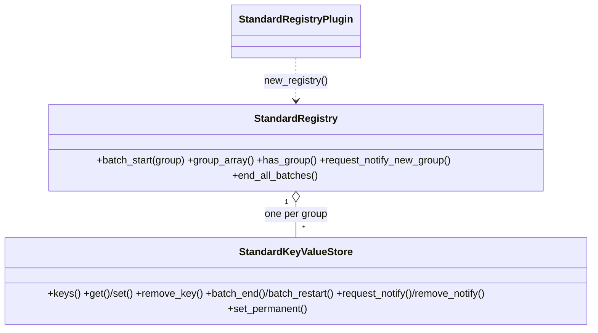
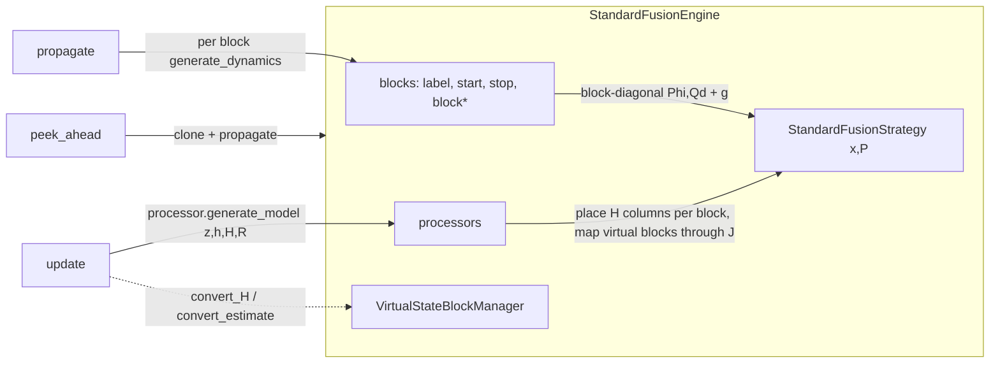
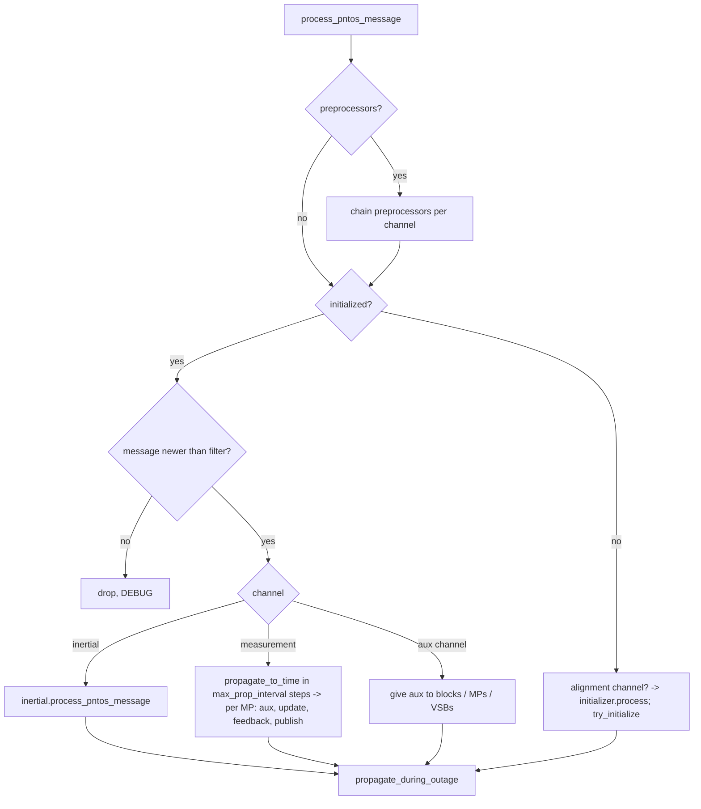

# pntos-cpp design guide

This is the working design document for the C++ rewrite of Cobra. It is written so that someone who
has the repository, the Python original (the `Cobra/` submodule) and a C++20 toolchain can continue
the port without any other context. Read it together with:

- `docs/COBRA_ANALYSIS.md` — what the Python original does, its baselines, its quirks (§12) and the
  original port plan (§13). This document supersedes §13 where they differ.
- `docs/TESTING.md` — how the test suite is organised, how to port a Python test, how acceptance is
  measured.
- `docs/PROGRESS.md` — the dated log of what was done and why.

Sections:

1. [Scope and principles](#1-scope-and-principles)
2. [Build system](#2-build-system)
3. [Repository layout and namespaces](#3-repository-layout-and-namespaces)
4. [Type and idiom mapping Python → C++](#4-type-and-idiom-mapping-python--c)
5. [The API layer](#5-the-api-layer)
6. [Conventions: errors, logging, ownership, threads](#6-conventions-errors-logging-ownership-threads)
7. [Component designs](#7-component-designs)
8. [Deviations from the Python original](#8-deviations-from-the-python-original)
9. [Roadmap: what remains and how to do it](#9-roadmap-what-remains-and-how-to-do-it)
10. [Recipes](#10-recipes)
11. [Coding conventions](#11-coding-conventions)

---

## 1. Scope and principles

The goal is a C++ implementation of the pntOS plugin architecture that is **behaviourally identical to
Cobra** (same registry layout, same config semantics, same filter mathematics, same message routing),
proved by porting Cobra's own test suite and then by reproducing its application-level results on the
example log (`COBRA_ANALYSIS.md` §2 and §14).

Principles that were applied throughout and should be kept:

1. **One Python class, one C++ class, same name, same method names.** Someone reading the Python can
   find the C++ immediately. `snake_case` methods are kept as in Python; the pntOS-C API names are the
   same anyway.
2. **Same registry layout.** Configs written by the C++ `to_registry` produce exactly the groups and
   keys the Python `config_to_registry` produces (nested configs as `_<field>_groups` pointers,
   EstimateWithCovariance as `_estimate` / `_covariance` / `_ewc_type`, enums as integers, 3-vectors
   as matrices). A Python-written permanency file and a C++-written one are interchangeable for every
   type except `Message` (Python pickles it; see §8).
3. **Fix a Python bug only when it is a bug, and record it.** Two latent bugs were found and fixed in
   the port (`COBRA_ANALYSIS.md` §12 items 1 and 14). Everything else, including odd log texts and
   quirky behaviours, is reproduced so that the ported tests pass unchanged.
4. **Eigen for all linear algebra, `aspn23_eigen` for all messages.** No xtensor anywhere. NavToolkit's
   math that Cobra calls from Python was re-implemented in Eigen (`nav::` namespace) rather than
   calling NavToolkit's xtensor API; NavToolkit itself will be consumed only for the inertial
   mechanization and alignment (§9).
5. **C++ classes first, C ABI later.** The pntOS-C `PntosManagedMemory` reference-counting ABI is not
   implemented. The API classes are shaped so a thin C shim can wrap them later (every factory returns
   an owning pointer, every plugin has a `plugin_type()`).

## 2. Build system

Meson + ninja, C++20, GCC 13 is the reference compiler. Everything is a meson subproject (wrap), so
nothing is installed system-wide and a fresh clone builds with:

```bash
python3 -m venv .venv && .venv/bin/pip install meson ninja
.venv/bin/meson setup build
.venv/bin/meson compile -C build
.venv/bin/meson test -C build
```

| Dependency | How it is pulled | Version | Used for |
|---|---|---|---|
| eigen | `subprojects/eigen.wrap` (wrapdb) | 5.0.1 | all matrices |
| gtest | `subprojects/gtest.wrap` (wrapdb) | 1.18.0 | tests |
| aspn-generated | `subprojects/aspn-generated.wrap` (git, pinned commit `8edae7ee…`) | is4s main | `aspn23_eigen` message classes + `aspn-c` structs |
| NavToolkit | **not yet added** (git wrap planned, see §9) | — | inertial mechanization, alignment |
| lcm | **not yet added** | — | LCM log transport |

Options (`meson_options.txt`): `tests` (default on) and `apps` (default on).

aspn-generated is configured with `aspn-cpp-eigen` enabled and the xtensor / STL / DDS / LCM variants
disabled (see the root `meson.build`). Message classes are `aspn23_eigen::MeasurementX`; message type
enums are `ASPN_MEASUREMENT_X`; field enums are `ASPN23_MEASUREMENT_X_FIELD_VALUE`. Optional doubles
are `NaN` when absent; an absent quaternion is a 4-vector of `NaN`.

The library target is `pntos-cobra` (static). `pntos_api_dep` is a header-only dependency on the API
plus Eigen and aspn; `cobra_dep` adds the library. Tests are one executable per suite, registered in
`tests/meson.build` under `test_sources`.

## 3. Repository layout and namespaces

```
include/pntos/api/            the pntOS API as abstract C++ classes        namespace pntos::api
include/pntos/cobra/          Cobra plugin implementations (public headers) namespace pntos::cobra
  config/                     BaseConfig, ConfigWriter/Reader, all configs
  controller/                 StandardMediator, StandardMessageStreamConfig, StandardControllerPlugin
  fusion/                     StandardFusionEngine/Plugin, VirtualStateBlockManager
  orchestration/              StandardOrchestrationPlugin, OrchestrationUtils     namespace pntos::cobra::orch
  state_modeling/             blocks, measurement processors, VSBs, provider plugin
  dummy/                      the dummy plugins
  utils/                      navutils (nav::), aspn helpers (utils::), arrays, logging, plugins
src/                          mirrors include/ one-to-one
tests/                        test_<suite>.cpp + test_support.hpp
apps/                         (empty until the inertial layer lands)
docs/                         this file, TESTING.md, PROGRESS.md, COBRA_ANALYSIS.md
Cobra/                        the Python original (submodule)
```

Python module → C++ header mapping for the pieces that exist:

| Python (`Cobra/pntos-cobra/src/pntos/cobra/…`) | C++ |
|---|---|
| `pntos.api.*` | `include/pntos/api/*.hpp` |
| `config/BaseConfig.py`, `config/utils.py` | `config/BaseConfig.hpp` |
| `config/*Config.py` (all others) | `config/configs.hpp` |
| `standard_plugins/EkfFusionStrategyPlugin.py` | `EkfFusionStrategyPlugin.hpp` |
| `standard_plugins/StandardLoggingPlugin.py` | `StandardLoggingPlugin.hpp` |
| `standard_plugins/registry/*` | `StandardRegistryPlugin.hpp` |
| `standard_plugins/state_modeling/state_blocks/*` | `state_modeling/SimpleStateBlocks.hpp`, `Pinson15NedBlock.hpp` |
| `standard_plugins/state_modeling/measurement_processors/*` | `state_modeling/MeasurementProcessors.hpp` |
| `standard_plugins/state_modeling/virtual_state_blocks/*` | `state_modeling/VirtualStateBlocks.hpp` |
| `standard_plugins/state_modeling/StandardStateModelingPlugin.py` | `state_modeling/StandardStateModelingPlugin.hpp` |
| `standard_plugins/fusion/*` | `fusion/*.hpp` |
| `standard_plugins/controller/*` | `controller/*.hpp` |
| `standard_plugins/StandardOrchestrationPlugin.py` | `orchestration/StandardOrchestrationPlugin.hpp` |
| `utils/orchestration_utils.py` | `orchestration/OrchestrationUtils.hpp` |
| `utils/plugins.py` (sorting/validation only) | `utils/plugins.hpp` |
| `utils/logging.py` | `utils/logging.hpp` |
| `utils/arrays.py` | `utils/arrays.hpp` |
| `navtk.navutils` (the parts Cobra uses) | `utils/navutils.hpp` |
| `dummy_plugins/*` | `dummy/DummyPlugins.hpp` |

## 4. Type and idiom mapping Python → C++

| Python | C++ | Notes |
|---|---|---|
| `TypeTimestamp` | `api::Timestamp { int64_t elapsed_nsec; }` | `seconds()`, `from_seconds()`, `to_aspn()` |
| `AspnBase` | `api::AspnBase = aspn23_eigen::TypeHeader` | base of every message class |
| `Message(wrapped_message, source_identifier)` | `api::Message { shared_ptr<AspnBase> wrapped_message; string source_identifier; }` | `as<T>()` does a `dynamic_pointer_cast`; `operator==` is pointer identity + source |
| `NDArray (n,1)` / `(n,)` | `api::Vector` (`Eigen::VectorXd`) | always a column |
| `NDArray (n,m)` | `api::Matrix` (`Eigen::MatrixXd`, column-major) | aspn classes want `RowMajorMatrix`; convert at the boundary |
| `EstimateWithCovariance` | `api::EstimateWithCovariance { type; Vector estimate; Matrix covariance; }` | |
| `CrossCovariances` | `api::CrossCovariances { vector<string> block_labels; vector<Matrix> cross_covariances; }` | |
| `RegistryValueTypeUnion` | `api::RegistryValue = variant<string, StringArray, int64_t, bool, double, Matrix, Message>` | `registry_value_as<T>` does Cobra's conversion table |
| `isinstance(plugin, FusionPlugin)` | `plugin->plugin_type() == PluginType::FUSION` then `dynamic_pointer_cast` | |
| `type[StandardFusionEngine]` (fusion type selector) | `api::FusionType::STANDARD` / `SAMPLED` | likewise `InertialType`, `InitializationType` |
| `X \| None` return | `std::optional<X>` (values) or `nullptr` (factories returning owning pointers) | |
| `list[Message \| None]` (aux data) | `api::AuxData = vector<optional<Message>>` | |
| `Callable[[list[str]], EWC \| None]` (`gen_x_and_p_func`) | `api::GenXandP = std::function<optional<EWC>(const vector<string>&)>` | |
| `copy.deepcopy(engine)` | `engine->clone()` | every block / MP / VSB / strategy / engine has `clone()` |
| registry notify callback identity (`remove_notify(callback)`) | `api::NotifyToken` returned by `request_notify` | |
| `with registry.batch_start(g) as kv:` | `auto kv = registry.batch(g);` (`api::Batch` RAII) | `batch_start()` + manual `batch_end()` also exists |
| `tuple[float, float, float]` in configs | `cobra::Vec3 = std::array<double,3>` (`Vec4`, `Mat3` likewise) | written to the registry as a Matrix, as Python does |
| `tuple[SomeConfig, ...]` nested configs | `std::vector<std::shared_ptr<const SomeConfig>>` | written as `_<field>_groups` |

## 5. The API layer

`include/pntos/api/` mirrors `pntos.api` (and pntOS-C's headers) as pure abstract classes. Nothing in
`api/` has behaviour beyond small value types. The headers are:

| Header | Contents |
|---|---|
| `types.hpp` | `Timestamp`, `Message`, `EstimateWithCovariance(+Type)`, `CrossCovariances`, `LoggingLevel`, `PluginType` (+`to_string`), `FusionType`, `RegistryValue(+Type)`, `KeyValueStoreDataFormat` |
| `common.hpp` | `KeyValueStore`, `Batch`, `Registry`, `Mediator`, `CommonPlugin`, `registry_value_as<T>` |
| `controller.hpp` | `ControllerPlugin`, `PlatformIntegrationPlugin`, `PluginList`, `ResourceLocations` |
| `transport.hpp` | `TransportPlugin` |
| `orchestration.hpp` | `MessageStreamConfig`, `OrchestrationPlugin` |
| `registry.hpp` | `RegistryPlugin`, `LoggingPlugin`, `UtilityPlugin`, `UiPlugin` |
| `state_modeling.hpp` | `StandardDynamicsModel`, `StandardMeasurementModel`, `GenXandP`, `AuxData`, `StandardStateBlock`, `VirtualStateBlock`, `StandardMeasurementProcessor`, `StandardStateModelProvider`, `StateModelingPlugin` |
| `fusion_strategy.hpp` | `StandardFusionStrategy`, `FusionStrategyPlugin` |
| `fusion.hpp` | `StandardFusionEngine`, `FusionPlugin` |
| `inertial.hpp` | `InertialForcesRates`, `StandardInertialErrors`, `CommonInertial`, `StandardInertialMechanization`, `InertialPlugin` |
| `initialization.hpp` | `InitializationStatus`, `InitialInertialSolution`, `CommonInitializationStrategy`, `InertialInitializationStrategy`, `EwcInitializationStrategy`, `InitializationPlugin` |
| `preprocessor.hpp` | `Preprocessor`, `PreprocessorPlugin` |
| `api.hpp` | umbrella |

Every plugin derives from `CommonPlugin` and implements `init_plugin(resources, Mediator*)`,
`shutdown_plugin()`, `identifier()`. `plugin_type()` is implemented once in each abstract plugin
class so sorting never needs RTTI on the plugin kind (RTTI is still used to downcast once the kind is
known).


## 6. Conventions: errors, logging, ownership, threads

**Two classes of error, handled differently** (this mirrors what the Python does implicitly):

- *Programming / shape errors* (wrong matrix dimensions, index out of range, a strategy used before
  `set_strategy`) **throw** `std::invalid_argument` / `std::logic_error`. Python would raise from numpy.
- *API-level failures* (unknown label, unsupported message type, missing aux data, config missing)
  **log through the mediator and return `nullopt` / `nullptr` / do nothing**, exactly where the Python
  logs and returns `None`. The log level is the same as Python's (`ERROR`, `WARN`, `DEBUG`), because the
  mediator turns an `ERROR` into a non-zero exit code when a controller is attached.
- VSB `convert` / `jacobian` on invalid state throw `std::runtime_error` (Python raises
  `RuntimeError`; tests check this).

**Logging** always goes through `Mediator::log_message`. When a component has no mediator (unit
tests, early controller start-up) it prints with `utils::print_message`, as Python does.

**Ownership:**

- The app owns plugins as `std::shared_ptr<CommonPlugin>` in an `api::PluginList`; the controller and
  orchestration keep `shared_ptr` copies of the ones they use.
- Factories (`new_fusion_engine`, `new_block`, …) return `std::unique_ptr`; the receiving container
  (fusion engine, orchestration) owns the object.
- `Mediator*` is a non-owning raw pointer; the controller guarantees mediators outlive plugins.
- Messages are immutable once created and shared by `shared_ptr`; **never mutate a message you did
  not just create** (the aspn classes own a C struct; use `utils::copy_pva` and the like to modify).
- Aux data handed to blocks is kept by `shared_ptr` copy, so `clone()` of a block shares the immutable
  aux message with the original. That is correct and cheap.

**Threads.** Cobra is effectively single-threaded under the GIL. The port keeps that model but makes it
explicit:

- `MediatorContext::mutex` (recursive) serialises `process_pntos_message` across transports; every
  orchestration call happens under it.
- `StandardRegistry` has its own mutex; batches are per group.
- `StandardMessageStreamConfig` is mutex-protected because the orchestration configures it while
  transports may already be reading it.
- `ExitEvent` is a condition-variable latch; the controller's main loop polls it every 100 ms and
  checks the SIGINT flag.
- Nothing in the fusion / state-modeling layer is thread-safe by itself and nothing needs to be.

## 7. Component designs

### 7.1 Registry (`StandardRegistryPlugin.hpp`)



- One `StandardKeyValueStore` per group, created on first `batch_start`. Keys keep insertion order (the
  Python dict order matters for `keys()`/`items()` expectations).
- A batch is "the store is checked out"; `batch_end()` fires notify callbacks for the keys modified
  during the batch, then releases. `api::Batch` is the RAII wrapper. Re-entrancy: a callback may open a
  batch on *another* group; opening the same group from its own callback deadlocks by design, as in
  Python.
- Notify callbacks are stored by `NotifyToken` (monotonic id). `request_notify(nullopt, cb)` means "any
  key".
- Permanency: `set_permanent(true)` writes the group to `<permanency_dir>/<group>.txt` after every
  batch and reloads it on first access. Format is a simple typed text format (one `key<TAB>type<TAB>value`
  per line, matrices as `rows cols v...`). `Message` values are **not** persisted (Python pickles them).
- `StandardRegistryPlugin(identifier, configs)` writes every config in `configs` into the fresh registry
  in `new_registry()` (Python's `StandardRegistryPlugin(config=[...])`). It builds a private
  `RegistryOverrideMediator` so configs can be written before any real mediator exists.

### 7.2 Configs (`config/BaseConfig.hpp`, `config/configs.hpp`)

Python uses dataclass introspection to write/read any config generically. C++ has no introspection, so
each config implements `to_registry(Mediator&)` and a static `from_registry(Mediator&, group)` using
two small helpers that encode the registry layout rules once:

- `ConfigWriter(mediator, group)`: `scalar`, `matrix`, `vector`, `strings`, `ewc`, `nested(key, cfg)`,
  `nested(key, vector<cfg>)`, `optional`. Warns if a key is overwritten. `nested` ends the current
  batch, writes the nested config to its own group, restarts the batch and records the pointer key.
- `ConfigReader(mediator, group)`: `require<T>` (logs WARN and marks the read failed), `optional<T>`,
  `ewc`, `require_ewc`, `nested_group`, `nested_groups`, `suspend`/`resume` (release this group's batch
  while reading a nested group), `ok()`.

Registry layout rules (identical to Python):

| Python field type | Registry key(s) | Value type |
|---|---|---|
| `int`, `float`, `str`, `bool` | `<field>` | `int64`, `double`, `string`, `bool` |
| `Enum` / `IntEnum` | `<field>` | `int64` |
| `tuple[float,...]`, `tuple[tuple[float,...],...]` | `<field>` | `Matrix` (n×1 or n×m) |
| `tuple[str,...]` | `<field>` | `StringArray` |
| `EstimateWithCovariance` | `_estimate`, `_covariance`, `_ewc_type` | `Matrix`, `Matrix`, `int64` |
| nested `BaseConfig` | `_<field>_groups` | `string` (the nested group) |
| `tuple[BaseConfig, ...]` | `_<field>_groups` | `StringArray` |
| `X \| None` that is `None` | key absent | |
| `group` | not a key; it is the group itself | |

Subclass-fixed fields (Python `field(default=..., init=False)`) are set in the C++ constructor
(`PinsonStateBlockConfig() { identifier = "pinson15"; }`). The nine measurement-processor config
dataclasses collapse to three C++ structs (`LeverArmMPConfig`, `LeverArmOrientationMPConfig`,
`PlainMPConfig`) plus factory helpers in `namespace mp` that set identifier and aux channels.

Polymorphic nested lists (`additional_sb_configs: tuple[StateBlockConfig, ...]`) are *written* from
the concrete configs and *read back* as the base type; the component that needs the full config reads it
again from the group (e.g. `PinsonStateBlockConfig::from_registry` inside the provider). This is how the
Python providers work too.

All configs that exist: `ImuConfig`, `FogmConfig`, `MountingConfig`, `StateBlockConfig` (+Pinson, Fogm,
ClockBias, Constant), `MeasurementProcessorConfig` (+LeverArm, LeverArmOrientation, Plain),
`VirtualStateBlockConfig` (+PinsonErrorToStandard, StateExtractor), `FusionEngineConfig`,
`ControllerConfig`, `Stream`, `StreamConfig` (+`default_stream_config()`), `InertialConfig`,
`FeedbackConfig`, `PreprocessorConfig` (+BarometerToAltitude, Downsampler, ImuRotator, TimeAdjuster,
TimeBias, Outage), `ManualAlignmentConfig`, `StaticAlignmentConfig`, `ManualHeadingAlignmentConfig`,
`StandardOrchestrationConfig`. Not yet ported: `PvaMessageInitializationConfig`, `LcmTransportConfig`,
`BuscatConfig`, `TutorialOrchestrationConfig`, the UI configs.

### 7.3 EKF strategy (`EkfFusionStrategyPlugin.hpp`)

`EkfFusionStrategy` holds `x_` (N) and `P_` (N×N). `add_states` appends with an optional upper-right
cross-covariance block and mirrors it; `remove_states` erases a contiguous range; `propagate` applies
`x = g(x)`, `P = Φ P Φᵀ + Qd` and symmetrises; `update` computes the innovation `z − h(x)`, the gain via an
`LDLT` solve of `S = H P Hᵀ + R`, and by default the **Joseph form** covariance update. `set_joseph_form
(false)` switches to Python's `(I − K H) P` so the ported unit tests can compare bit-for-bit against
Python's expected values. Production should keep Joseph on.

### 7.4 State blocks (`state_modeling/SimpleStateBlocks.hpp`, `Pinson15NedBlock.hpp`)

| Block | States | Dynamics | Aux |
|---|---|---|---|
| `FogmBlock(label, med, sigmas, taus)` | n | `Φ = diag(e^{-dt/τ})`, `Qd = ½(Φ Q Φᵀ + Q) dt`, `Q = diag(2σ²/τ)` | none |
| `ConstantStateBlock(label, med, n, Q?)` | n | `Φ = I`, `Qd = Q dt` | none |
| `ClockBiasStateBlock(label, med, h0, h−2, q3?)` | 2 | Hwang–Brown clock model | none |
| `Pinson15NedBlock(label, med, ImuConfig)` | 15 | Pinson NED error model, `F` from the current inertial PVA + specific force, `Φ = expm(F dt)` via Taylor/Padé, `Qd` by Van Loan (`nav::` helpers) | **PVA** (any geodetic `MeasurementPositionVelocityAttitude`) and **forces** (`MeasurementImu` carrying specific force in NED and body rates) in `receive_aux_data`, in that order |

State order of Pinson15: δpos NED (m), δvel NED (m/s), tilt (rad), accel bias (m/s²), gyro bias
(rad/s). The sensor-frame process noise block for accel/gyro is rotated into NED with the current
attitude on every call **from a copy** (fixes Python's in-place mutation,
`QIsNotMutatedAcrossCalls` test).

### 7.5 Measurement processors (`state_modeling/MeasurementProcessors.hpp`)

All nine share `PinsonProcessorBase` (label, labels, inertial PVA aux, common checks). Index order in the
provider is the Python order and must not change (configs refer to identifiers, but tests use indices):

| # | Identifier | C++ class | Blocks (in order) | Measurement | Aux |
|---|---|---|---|---|---|
| 0 | `pinson_position` | `PinsonPositionMeasurementProcessor(Kind::Plain)` | pinson | `MeasurementPosition` geodetic | PVA |
| 1 | `pinson_velocity` | `PinsonVelocityMeasurementProcessor` | pinson | `MeasurementVelocity` NED | PVA |
| 2 | `pinson_with_ned_fogm_position` | `…(Kind::WithNedFogm)` | pinson, fogm(3) | position | PVA |
| 3 | `pinson_altitude` | `AltitudeMeasurementProcessor` | pinson, fogm(1) | `MeasurementAltitude` HAE or geodetic position | PVA |
| 4 | `pinson_with_lever_arm_position` | `…(Kind::WithLeverArm)` | pinson, fogm(3), fogm(3) | position | PVA |
| 5 | `pinson_body_velocity` | `PinsonBodyVelocityMeasurementProcessor` | pinson | `MeasurementVelocity` sensor frame, NaN axes masked | PVA + forces/rates |
| 6 | `pinson_posvel` | `PinsonPosVelMeasurementProcessor` | pinson | PVA (pos+vel) | PVA |
| 7 | `position` | `PositionMeasurementProcessor` | pos-block(≥3), fogm(3) | position, direct (non-error) states | none |
| 8 | `direction3D_to_points` | `Direction3DToPointsMeasurementProcessor` | pinson | `MeasurementDirection3DToPoints` | PVA |

`generate_model` returns `nullopt` (after an `ERROR` log) for wrong frame, missing/stale aux, wrong number
of block labels or a state vector of unexpected size. The exact `H`, `z`, `h(x)`, `R` formulas are pinned
by `tests/test_state_modeling.cpp`, which was ported line-by-line from the Python test. MSL altitude needs
a geoid model and is currently rejected (see §9).

### 7.6 Virtual state blocks and the manager

`PinsonErrorToStandard(source → target)` converts the 15 Pinson error states into a direct PVA-style
state (lat, lon, alt, vN, vE, vD, roll, pitch, yaw, biases…) using the latest inertial PVA aux; the
Jacobian is analytic (checked against central differences in the tests). `StateExtractor` picks index
subsets. Both throw `std::runtime_error` from `convert*`/`jacobian` on missing/stale/invalid aux.

`VirtualStateBlockManager` keeps a forest of `Node{id, parent?, children, block?}`. Roots are real
blocks (they have no VSB). `convert`, `convert_estimate`, `jacobian` walk the cached path root→target and
chain the blocks; `get_start_block_label` caches the root per target. The manager is deep-copyable
(clones every VSB) so the fusion engine's `clone()` works.

### 7.7 Fusion engine (`fusion/StandardFusionPlugin.hpp`)



Design points:

- Blocks live in an insertion-ordered vector; `start/stop` indices are recomputed after a removal.
- `propagate` assembles block-diagonal `Φ`, `Qd` and a `g` that applies each block's `g` to its slice.
- `update` resolves each label the processor names to (real block, virtual?) and places that
  processor's `H` columns into the full `H`. For a virtual label the processor's columns are the
  **virtual** width and are mapped back with the chain-rule Jacobian `H_real = H_virt · J`; `h(x)` converts
  the real slice through the VSB before calling the processor's `h`. (Python slices by the *real* width,
  which only works when the VSB preserves size; see `COBRA_ANALYSIS.md` §12 #14.)
- `peek_ahead(time, labels)` clones the whole engine (strategy, blocks, processors, VSBs), propagates the
  clone and reads the joint estimate. That is Python's `deepcopy` and it is called once per published
  solution, so keep `clone()` cheap.
- Optional diagnostics: with `save_x_and_p_after_prop/update` the engine writes `state_labels`, `time`,
  `estimate`, `sigma` to the `diagnostics` group after each step, deleting `time` first so a notify fires
  even when the time repeats.

### 7.8 Controller layer (`controller/`)

Python keeps the mediator's shared state in **class attributes** (`StandardMediator._logging_plugin`,
`_messages`, …) which makes it a process-wide singleton. The port moves that state into
`MediatorContext`, owned by the controller and shared (by `shared_ptr`) by one `StandardMediator` per
plugin. Everything else is the same:

```mermaid
sequenceDiagram
  participant T as TransportPlugin
  participant M as StandardMediator
  participant C as MediatorContext
  participant O as OrchestrationPlugin
  T->>M: process_pntos_message(msg)
  M->>C: lock; ui gate (ui/channel/<src>: enabled_mediator)
  alt immediate (stream config)
    M->>O: process_pntos_message(msg, sequenced=false)
  else sequenced
    M->>C: insert into time-sorted buffer
  end
  M->>C: split buffer at newest_tov - buffer_length
  loop released messages (time order)
    M->>O: process_pntos_message(m, sequenced=true)
  end
  opt publish interval elapsed
    M->>O: request_solutions([newest_tov])
    M->>T: broadcast_message(solution, destination=solution.source)
  end
```

- `StandardMessageStreamConfig`: `(type, source?) → BufferMode`, exact source match first, then
  type-wide, then the default. `*_stream_all(enable)` ignores `enable` like Python (upstream TODO #66).
- `UiMediatorInterface`: creates `ui/channel/<source>` with `enabled_mediator=true` on first sight,
  registers a notify to track that flag, and publishes `message_count`, `type`, `tov_last_message` at most
  every 0.5 s. Python's rate/jitter/bandwidth statistics are not ported (UI is Tier 2).
- `StandardControllerPlugin::take_control`: validate the plugin set (1 registry, 1 logging,
  1 orchestration, ≥1 transport, ≥1 fusion), make one mediator per plugin, init registry → logging → the
  rest, give the orchestration its plugins and the stream config, read `ControllerConfig`, watch
  `controller/flags: ready_to_shutdown`, start transports, hand the main thread to a UI plugin that wants
  it or wait on the `ExitEvent` (SIGINT via `install_sigint_handler()`), then shut everything down
  (registry and logging last). `exit_code()` replaces Python's `sys.exit(1)`.

### 7.9 Orchestration (`orchestration/`)



- `try_initialize()` runs when the initializer reports `INITIALIZED_GOOD`: ask it for the initial
  solution, create the inertial from it (and apply initial biases), build the Pinson block with
  `blockdiag(PVA cov, bias cov)`, set the engine time, build the `SolutionCache`.
- `SolutionCache` replaces Python's `Cache`/`CacheEntry`: three lazily recomputed values keyed on the
  engine time — the inertial solution at filter time, the Pinson `x`/`P`, and the corrected filter solution.
  `update` clears the last two; feedback clears all three.
- Feedback (`apply_inertial_feedback`): gated by `FeedbackConfig` thresholds; resets the inertial to the
  corrected solution, subtracts the estimated biases from the inertial's sensor errors, zeroes the Pinson
  states.
- `request_solutions` accepts exactly one time; out-of-range times are replaced by the latest inertial
  time (DEBUG log) as in Python.

## 8. Deviations from the Python original

Every deviation is deliberate and listed here; anything not listed is intended to be identical.

| # | Deviation | Why |
|---|---|---|
| 1 | Pinson15 process-noise matrix is rotated from a copy, not in place | Python bug (`COBRA_ANALYSIS.md` §12 #1). Test `QIsNotMutatedAcrossCalls`. |
| 2 | Fusion engine `update` uses the virtual block width for a VSB-targeted processor | Python bug (§12 #14). Test `UpdateThroughRealAndVirtualBlocks`. |
| 3 | EKF uses Joseph form + LDLT by default | Numerical robustness; `set_joseph_form(false)` restores Python's arithmetic for parity tests. |
| 4 | Shape errors throw instead of raising inside numpy | C++ idiom; same observable effect (crash on programmer error). |
| 5 | Registry permanency uses a text format and does not persist `Message` values | Python pickles; not portable. |
| 6 | Notify callbacks are identified by `NotifyToken` | C++ `std::function` has no identity. |
| 7 | Mediator shared state lives in `MediatorContext` instead of class attributes | Testability; multiple controllers in one process. |
| 8 | `UiMediatorInterface` publishes only count/type/last TOV, throttled | UI statistics are Tier 2; the gate semantics are complete. |
| 9 | `SolutionCache` with typed entries instead of a generic cache | Type safety; same invalidation rules. |
| 10 | Nested config lists read back as base types | No introspection; providers re-read their own groups (as the Python providers do anyway). |
| 11 | MSL altitude measurements are rejected until a geoid model is wired in | navtk's geoid lookup is not ported yet (§9). |
| 12 | `has_virtual_state_block` returns true only for nodes known to the manager (roots included, as Python) | identical; listed because the API doc says otherwise (§12 #5). |

## 9. Roadmap: what remains and how to do it

Ordered so that the `pos_ins` app becomes runnable as early as possible. Each item names the Python
source to port, the planned C++ location, and the tests to port.

### 9.1 NavToolkit subproject + inertial plugin

- **Python:** `standard_plugins/inertial/StandardInertialPlugin.py` (wraps `navtk.filtering.InertialMechanization`
  / `NavSolution` / buffering), `tests/test_inertial_plugin.py`.
- **C++:** `include/pntos/cobra/inertial/StandardInertialPlugin.hpp`. Add `subprojects/navtoolkit.wrap`
  (git, pin a commit; NavToolkit is a meson project with an xtensor dependency, so the wrap will pull
  xtensor/xtl as well; keep it `default_options: ['python=disabled']` or equivalent). Convert at the
  boundary only: Eigen ↔ xtensor for the PVA/IMU vectors, never inside the filter code.
- The class implements `api::StandardInertialMechanization`: ring buffer of mechanized solutions of
  `inertial_buffer_length` seconds, `request_solution(time)` with interpolation, `request_forces_and_rates`
  / `request_average_forces_and_rates` from the buffered IMU data (specific force rotated to NED, rates in
  body), `reset_solution` (re-mechanize from the reset time forward), sensor error correction
  (biases, scale factors), `is_time_in_range`, earliest/latest time.
- `InertialConfig.C_imu_to_platform` rotates incoming IMU samples; `expected_dt` detects gaps.
- Alternative if NavToolkit integration proves painful: port the mechanization itself into `nav::`
  (NavToolkit's `InertialMechanization` is ~600 lines of xtensor; the formulas needed are already in
  `navutils.hpp`). Decide after one day of trying the wrap.

### 9.2 Alignment (initialization) plugins

- **Python:** `standard_plugins/initialization/ManualAlignInitializationPlugin.py`,
  `StaticAlignInitializationPlugin.py`, `ManualHeadingAlignInitializationPlugin.py`,
  `PvaMessageInitializationPlugin.py`, `tests/inertial_alignment/*`, `test_manual_initialization_plugin.py`.
- **C++:** `include/pntos/cobra/initialization/*.hpp`. Each returns an `InertialInitializationStrategy`:
  manual (immediately good from `ManualAlignmentConfig`), static (average `static_time` of IMU to level
  and gyro-compass, from `navtk.filtering.StaticAlign`), manual heading (static levelling + configured
  heading), PVA message (first PVA on a channel). The orchestration tests' `MockInitializer` shows the
  contract they must satisfy.

### 9.3 Preprocessors

- **Python:** `standard_plugins/preprocessors/*.py`, `tests/test_preprocessor_plugin.py`.
- **C++:** `include/pntos/cobra/preprocessing/StandardPreprocessorPlugin.hpp`. Six preprocessors
  (`ImuRotation`, `TimeAdjuster`, `TimeBias`, `Downsampler`, `Outage`, `BarometerToAltitude`); configs
  already exist in `configs.hpp`. Identifier order must be the Python order:
  `['imu_rotator', 'time_adjuster', 'time_bias', 'downsampler', 'outage', 'baro_converter']` — check
  `StandardPreprocessorPlugin.preprocessor_identifiers` before relying on this.

### 9.4 LCM transport

- **Python:** `standard_plugins/transport/LcmLogTransportPlugin.py` (+ `LcmTransportPlugin.py`),
  `utils/lcm_utils.py`, `config/LcmTransportConfig.py`, `tests/test_transport_plugin.py`.
- **C++:** needs `lcm` (meson wrap or system package) and aspn-generated's LCM C++ bindings
  (`aspn23_lcm`), plus the `aspn23_lcm → aspn23_eigen` conversions (aspn-generated provides converters;
  check `aspn-cpp/src/aspn23/lcm`). The log transport replays an `.lcmlog` on its own thread,
  mapping channel → message type, calling `mediator->process_pntos_message`, and sets
  `controller/flags: ready_to_shutdown` at EOF.

### 9.5 Apps and acceptance

- `apps/dummy/minimal`: dummy controller + dummy orchestration + dummy transport (all exist).
- `apps/standard/pos_ins`: `Cobra/pntos-cobra/src/pntos/cobra/apps/standard/pos_ins.py` — build the
  config list in C++ exactly as the Python app does, run `StandardControllerPlugin::take_control`.
- Acceptance: run on the example log and reproduce `COBRA_ANALYSIS.md` §2 (pos RMS 0.92/1.24/1.67 m,
  vel RMS 0.084/0.093/0.043 m/s, tilt RMS 0.074/0.092/0.811°) within a few percent; the Python
  `utils/plots.py` / truth comparison can be reused from the venv on the C++ output log.

### 9.6 Later (Tier 2/3)

Geoid model (MSL altitude), UI plugin and registry views, diagnostic/HDF5 log plugin, ROS transport,
Buscat controller, tutorial plugins, the C ABI shim.

## 10. Recipes

**Add a state block**

1. Derive from `api::StandardStateBlock`; implement `label`, `num_states`, `receive_aux_data`,
   `generate_dynamics(gen_x_and_p, from, to)` and `clone()`.
2. Add a config struct in `configs.hpp` deriving from `StateBlockConfig` with a `kIdentifier`, its own
   `to_registry` (call `write_base(w)` first) and `from_registry` (call `read_base(r)`).
3. Register the identifier in `StandardStateModelProvider::block_ids_` and the construction in
   `new_block` (`StandardStateModelingPlugin.cpp`). Append at the end to keep indices stable.
4. Port or write its test in `tests/test_simple_state_blocks.cpp` (closed-form `Φ`, `Qd` checks).

**Add a measurement processor**

1. Derive from `PinsonProcessorBase` (or `api::StandardMeasurementProcessor`); implement
   `generate_model` returning `nullopt` after an `ERROR` log on any rejection; implement `clone()`.
2. Config: usually one of the three existing structs via a new `mp::XxxMPConfig()` helper; add the
   identifier constant to `namespace mp`.
3. Register in `processor_ids_` / `new_processor`. Test `H`, `z`, `h(x)`, `R` against hand-derived values.

**Add a virtual state block**: derive from `api::VirtualStateBlock`, throw `std::runtime_error` on invalid
state in `convert*`/`jacobian`, implement `clone()`; register in `vsb_ids_` / `new_virtual_block`; test
the Jacobian with central differences (see `test_virtual_state_blocks.cpp`).

**Add a preprocessor**: derive from `api::Preprocessor`; the plugin maps identifier index → constructor
with the config group; the orchestration routes by `PreprocessorConfig.channels`.

**Add a plugin kind implementation**: derive from the `api::` abstract plugin; keep the mediator pointer
from `init_plugin`; log through it; in tests drive it with `TestMediator`.

**Add a config**: struct deriving `BaseConfig` with `group_`, `group()`, `to_registry`, static
`from_registry`; use `ConfigWriter`/`ConfigReader`; add a round-trip test (write → read → compare).

## 11. Coding conventions

- C++20, `-Wall -Wextra` clean. Format with clang-format (Google style, 120 columns, 2-space indent) —
  a `.clang-format` should be added with those settings; the code was written to match it.
- Names: classes `PascalCase` (matching Python), methods and free functions `snake_case` (matching
  Python/pntOS-C), members `trailing_underscore_`, constants `kPascalCase`.
- Headers are self-contained and include what they use; implementation files include their own header
  first.
- `api::Vector`/`api::Matrix` everywhere in interfaces; fixed-size Eigen types only inside function
  bodies and in `nav::`.
- No `using namespace` in headers. In `.cpp` files `using api::X;` for the handful of types used.
- Comments explain *why* and point to the Python when the behaviour is non-obvious; do not restate the
  code.
- Every behavioural change ships with a test and a line in `docs/PROGRESS.md`.
