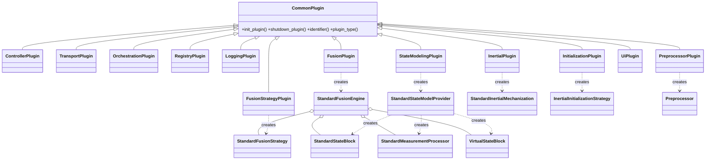
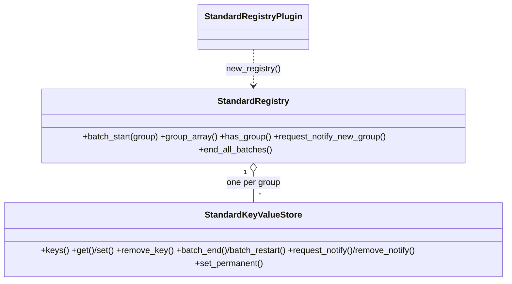
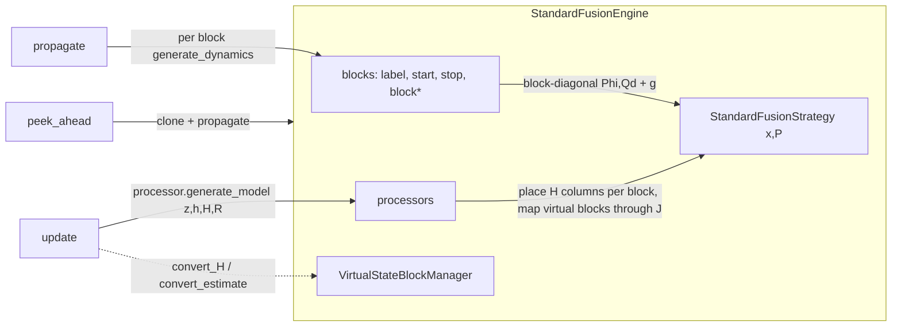
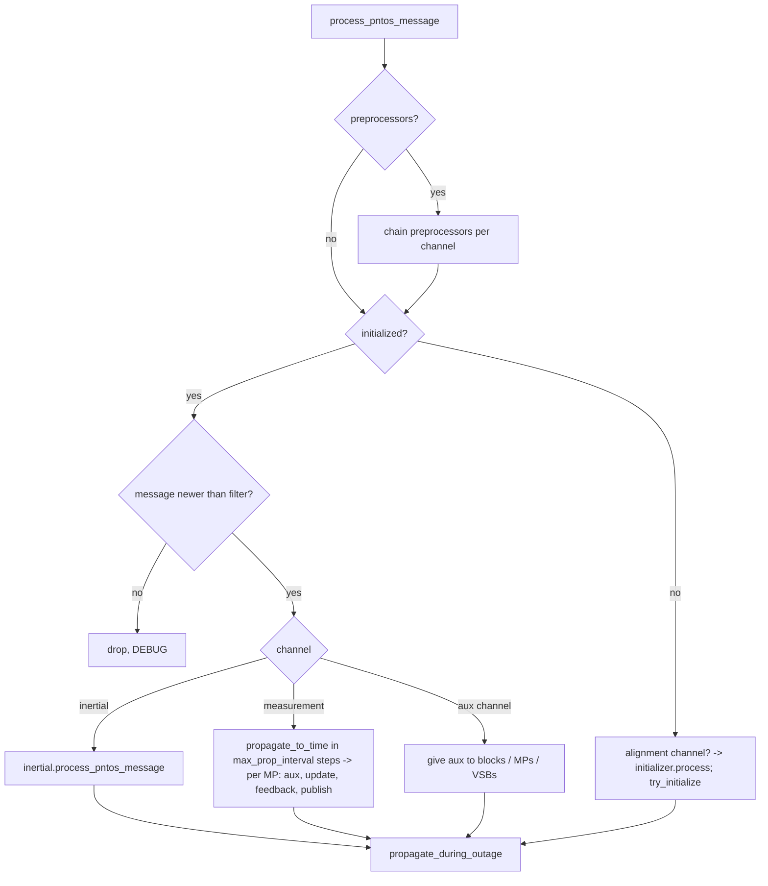

# pntos-cpp design guide

This is the working design document for the C++ rewrite of Cobra. It is written so that someone who
has the repository, the Python original (the `Cobra/` submodule) and a C++20 toolchain can continue
the port without any other context. Read it together with:

- `docs/COBRA_ANALYSIS.md` — what the Python original does, its baselines, its quirks (§12) and the
  original port plan (§13). This document supersedes §13 where they differ.
- `docs/TESTING.md` — how the test suite is organised, how to port a Python test, how acceptance is
  measured.
- `docs/PROGRESS.md` — the dated log of what was done and why.

Sections:

1. [Scope and principles](#1-scope-and-principles)
2. [Build system](#2-build-system)
3. [Repository layout and namespaces](#3-repository-layout-and-namespaces)
4. [Type and idiom mapping Python → C++](#4-type-and-idiom-mapping-python--c)
5. [The API layer](#5-the-api-layer)
6. [Conventions: errors, logging, ownership, threads](#6-conventions-errors-logging-ownership-threads)
7. [Component designs](#7-component-designs)
8. [Deviations from the Python original](#8-deviations-from-the-python-original)
9. [Roadmap: what remains and how to do it](#9-roadmap-what-remains-and-how-to-do-it)
10. [Recipes](#10-recipes)
11. [Coding conventions](#11-coding-conventions)

---

## 1. Scope and principles

The goal is a C++ implementation of the pntOS plugin architecture that is **behaviourally identical to
Cobra** (same registry layout, same config semantics, same filter mathematics, same message routing),
proved by porting Cobra's own test suite and then by reproducing its application-level results on the
example log (`COBRA_ANALYSIS.md` §2 and §14).

Principles that were applied throughout and should be kept:

1. **One Python class, one C++ class, same name, same method names.** Someone reading the Python can
   find the C++ immediately. `snake_case` methods are kept as in Python; the pntOS-C API names are the
   same anyway.
2. **Same registry layout.** Configs written by the C++ `to_registry` produce exactly the groups and
   keys the Python `config_to_registry` produces (nested configs as `_<field>_groups` pointers,
   EstimateWithCovariance as `_estimate` / `_covariance` / `_ewc_type`, enums as integers, 3-vectors
   as matrices). A Python-written permanency file and a C++-written one are interchangeable for every
   type except `Message` (Python pickles it; see §8).
3. **Fix a Python bug only when it is a bug, and record it.** Two latent bugs were found and fixed in
   the port (`COBRA_ANALYSIS.md` §12 items 1 and 14). Everything else, including odd log texts and
   quirky behaviours, is reproduced so that the ported tests pass unchanged.
4. **Eigen for all linear algebra, `aspn23_eigen` for all messages.** No xtensor anywhere. NavToolkit's
   math that Cobra calls from Python was re-implemented in Eigen (`nav::` namespace) rather than
   calling NavToolkit's xtensor API, and the inertial mechanization and alignment were ported the same way
   (§9.1, §9.2). There is no NavToolkit dependency.
5. **C++ classes first, C ABI later.** The pntOS-C `PntosManagedMemory` reference-counting ABI is not
   implemented. The API classes are shaped so a thin C shim can wrap them later (every factory returns
   an owning pointer, every plugin has a `plugin_type()`).

## 2. Build system

Meson + ninja, C++20, GCC 13 is the reference compiler. Everything is a meson subproject (wrap), so
nothing is installed system-wide and a fresh clone builds with:

```bash
python3 -m venv .venv && .venv/bin/pip install meson ninja
.venv/bin/meson setup build
.venv/bin/meson compile -C build
.venv/bin/meson test -C build
```

| Dependency | How it is pulled | Version | Used for |
|---|---|---|---|
| eigen | `subprojects/eigen.wrap` (wrapdb) | 5.0.1 | all matrices |
| gtest | `subprojects/gtest.wrap` (wrapdb) | 1.18.0 | tests |
| aspn-generated | `subprojects/aspn-generated.wrap` (git, pinned commit `8edae7ee…`) | is4s main | `aspn23_eigen` message classes + `aspn-c` structs |
| NavToolkit | not used: the needed parts were ported into Eigen (§9.1, §9.2) | — | — |
| lcm | not needed: log format read/written directly; core header vendored in `third_party/lcm` | 1.5.x header | LCM log transport |

Options (`meson_options.txt`): `tests` (default on) and `apps` (default on).

aspn-generated is configured with `aspn-cpp-eigen` enabled and the xtensor / STL / DDS / LCM variants
disabled (see the root `meson.build`). Message classes are `aspn23_eigen::MeasurementX`; message type
enums are `ASPN_MEASUREMENT_X`; field enums are `ASPN23_MEASUREMENT_X_FIELD_VALUE`. Optional doubles
are `NaN` when absent; an absent quaternion is a 4-vector of `NaN`.

The library target is `pntos-cobra` (static). `pntos_api_dep` is a header-only dependency on the API
plus Eigen and aspn; `cobra_dep` adds the library. Tests are one executable per suite, registered in
`tests/meson.build` under `test_sources`.

## 3. Repository layout and namespaces

```
include/pntos/api/            the pntOS API as abstract C++ classes        namespace pntos::api
include/pntos/cobra/          Cobra plugin implementations (public headers) namespace pntos::cobra
  config/                     BaseConfig, ConfigWriter/Reader, all configs
  controller/                 StandardMediator, StandardMessageStreamConfig, StandardControllerPlugin
  fusion/                     StandardFusionEngine/Plugin, VirtualStateBlockManager
  orchestration/              StandardOrchestrationPlugin, OrchestrationUtils     namespace pntos::cobra::orch
  state_modeling/             blocks, measurement processors, VSBs, provider plugin
  inertial/                   Mechanization, BufferedImu, StandardInertialPlugin  namespace pntos::cobra::inertial
  initialization/             Alignment (ImuModel, static/manual-heading), InitializationPlugins
  preprocessing/              StandardPreprocessorPlugin (six preprocessors)
  transport/                  LcmLog (reader/writer), LcmConversions, LcmLogTransportPlugin, LcmUdpTransportPlugin, CsvTransportPlugin  namespace pntos::cobra::lcm
  capi/                       cobra.h, the C ABI over the push API
  tutorial/                   TutorialStateModelingPlugin, TutorialOrchestrationPlugin, UiLogPlottingPlugin, TutorialPlugins.hpp
  diagnostics/                DiagnosticLogPlugin (records the `diagnostics` registry group to HDF5)
  extras/                     AdvancedPreprocessorPlugin (ZeroVelocity2dGenerator)
  dummy/                      the dummy plugins
  presets/                    IMU error-model and GNSS receiver presets by name
  app/                        AppBuilder (plugin set from an AppSpec, overrides, run, run via push), Filter (push API)
  utils/                      navutils (nav::), aspn helpers (utils::), arrays, logging, plugins, hdf5 (writer), effective_time
  config/JsonConfig.hpp       JSON config files (Python class and field names), AppSpec, registry dump
src/                          mirrors include/ one-to-one
configs/                      one JSON file per app, written by the apps' --dump-config
testdata/                     example_60s.log, the first 60 s of the example log, for CI
tests/                        test_<suite>.cpp + test_support.hpp
apps/                         dummy/minimal, standard/* (9 apps), tutorial/* (2), extras/pos_ins_zerovel2d
third_party/                  vendored header-only code (lcm_coretypes.h, lcm-gen ASPN classes), see NOTICE.md
tools/                        run_acceptance.py, test_matrix.py, compare_to_truth.py, parity tools (see TESTING.md §8a)
docs/                         this file, TESTING.md, PROGRESS.md, COBRA_ANALYSIS.md
Cobra/                        the Python original (submodule)
```

Python module → C++ header mapping for the pieces that exist:

| Python (`Cobra/pntos-cobra/src/pntos/cobra/…`) | C++ |
|---|---|
| `pntos.api.*` | `include/pntos/api/*.hpp` |
| `config/BaseConfig.py`, `config/utils.py` | `config/BaseConfig.hpp` |
| `config/*Config.py` (all others) | `config/configs.hpp` |
| `standard_plugins/EkfFusionStrategyPlugin.py` | `EkfFusionStrategyPlugin.hpp` |
| `standard_plugins/StandardLoggingPlugin.py` | `StandardLoggingPlugin.hpp` |
| `standard_plugins/registry/*` | `StandardRegistryPlugin.hpp` |
| `standard_plugins/state_modeling/state_blocks/*` | `state_modeling/SimpleStateBlocks.hpp`, `Pinson15NedBlock.hpp` |
| `standard_plugins/state_modeling/measurement_processors/*` | `state_modeling/MeasurementProcessors.hpp` |
| `standard_plugins/state_modeling/virtual_state_blocks/*` | `state_modeling/VirtualStateBlocks.hpp` |
| `standard_plugins/state_modeling/StandardStateModelingPlugin.py` | `state_modeling/StandardStateModelingPlugin.hpp` |
| `standard_plugins/fusion/*` | `fusion/*.hpp` |
| `standard_plugins/controller/*` | `controller/*.hpp` |
| `standard_plugins/StandardOrchestrationPlugin.py` | `orchestration/StandardOrchestrationPlugin.hpp` |
| `utils/orchestration_utils.py` | `orchestration/OrchestrationUtils.hpp` |
| `utils/plugins.py` (sorting/validation only) | `utils/plugins.hpp` |
| `utils/logging.py` | `utils/logging.hpp` |
| `utils/arrays.py` | `utils/arrays.hpp` |
| `navtk.navutils` (the parts Cobra uses) | `utils/navutils.hpp` |
| `standard_plugins/StandardInertialPlugin.py` + navtk `BufferedImu`/mechanization | `inertial/StandardInertialPlugin.hpp`, `inertial/BufferedImu.hpp`, `inertial/Mechanization.hpp` |
| `tutorial_plugins/TutorialInitializationPlugin.py`, `standard_plugins/{StaticAlign,ManualHeadingAlign,PvaMessage}InitializationPlugin.py` + navtk alignment | `initialization/InitializationPlugins.hpp`, `initialization/Alignment.hpp` |
| `standard_plugins/preprocessor/*` | `preprocessing/StandardPreprocessorPlugin.hpp` |
| `standard_plugins/LcmLogTransportPlugin.py`, `utils/lcm_utils.py`, `aspn23_lcm_conversions` | `transport/LcmLogTransportPlugin.hpp`, `transport/LcmLog.hpp`, `transport/LcmConversions.hpp` |
| `pntos-cobra-apps/.../standard/*.py`, `dummy/minimal.py` | `apps/standard/*.cpp` (shared `app_common.hpp`), `apps/dummy/minimal.cpp` |
| `pntos-cobra-apps/.../tutorial/{pos_ins,pos_vel_ins}.py` | `apps/tutorial/{pos_ins,pos_vel_ins}.cpp` (shared `tutorial_common.hpp`) |
| `pntos-cobra-apps/.../extras/pos_ins_zerovel2d.py` | `apps/extras/pos_ins_zerovel2d.cpp` |
| `tutorial_plugins/state_modeling/*`, `tutorial_plugins/TutorialPos{,Vel}OrchestrationPlugin.py`, `UiLogPlottingPlugin.py`, `TutorialLcmLogTransportPlugin.py` | `tutorial/TutorialStateModelingPlugin.hpp`, `tutorial/TutorialOrchestrationPlugin.hpp`, `tutorial/UiLogPlottingPlugin.hpp`, `tutorial/TutorialPlugins.hpp` (transport alias) |
| `standard_plugins/DiagnosticLogPlugin.py`, `utils/hdf5.py` | `diagnostics/DiagnosticLogPlugin.hpp`, `utils/hdf5.hpp` |
| `extras/plugins/preprocessor/*`, `extras/config/PreprocessorConfig.py` | `extras/AdvancedPreprocessorPlugin.hpp`, `ZeroVelocity2dGeneratorConfig` in `config/configs.hpp` |
| `dummy_plugins/*` | `dummy/DummyPlugins.hpp` |

## 4. Type and idiom mapping Python → C++

| Python | C++ | Notes |
|---|---|---|
| `TypeTimestamp` | `api::Timestamp { int64_t elapsed_nsec; }` | `seconds()`, `from_seconds()`, `to_aspn()` |
| `AspnBase` | `api::AspnBase = aspn23_eigen::TypeHeader` | base of every message class |
| `Message(wrapped_message, source_identifier)` | `api::Message { shared_ptr<AspnBase> wrapped_message; string source_identifier; }` | `as<T>()` does a `dynamic_pointer_cast`; `operator==` is pointer identity + source |
| `NDArray (n,1)` / `(n,)` | `api::Vector` (`Eigen::VectorXd`) | always a column |
| `NDArray (n,m)` | `api::Matrix` (`Eigen::MatrixXd`, column-major) | aspn classes want `RowMajorMatrix`; convert at the boundary |
| `EstimateWithCovariance` | `api::EstimateWithCovariance { type; Vector estimate; Matrix covariance; }` | |
| `CrossCovariances` | `api::CrossCovariances { vector<string> block_labels; vector<Matrix> cross_covariances; }` | |
| `RegistryValueTypeUnion` | `api::RegistryValue = variant<string, StringArray, int64_t, bool, double, Matrix, Message>` | `registry_value_as<T>` does Cobra's conversion table |
| `isinstance(plugin, FusionPlugin)` | `plugin->plugin_type() == PluginType::FUSION` then `dynamic_pointer_cast` | |
| `type[StandardFusionEngine]` (fusion type selector) | `api::FusionType::STANDARD` / `SAMPLED` | likewise `InertialType`, `InitializationType` |
| `X \| None` return | `std::optional<X>` (values) or `nullptr` (factories returning owning pointers) | |
| `list[Message \| None]` (aux data) | `api::AuxData = vector<optional<Message>>` | |
| `Callable[[list[str]], EWC \| None]` (`gen_x_and_p_func`) | `api::GenXandP = std::function<optional<EWC>(const vector<string>&)>` | |
| `copy.deepcopy(engine)` | `engine->clone()` | every block / MP / VSB / strategy / engine has `clone()` |
| registry notify callback identity (`remove_notify(callback)`) | `api::NotifyToken` returned by `request_notify` | |
| `with registry.batch_start(g) as kv:` | `auto kv = registry.batch(g);` (`api::Batch` RAII) | `batch_start()` + manual `batch_end()` also exists |
| `tuple[float, float, float]` in configs | `cobra::Vec3 = std::array<double,3>` (`Vec4`, `Mat3` likewise) | written to the registry as a Matrix, as Python does |
| `tuple[SomeConfig, ...]` nested configs | `std::vector<std::shared_ptr<const SomeConfig>>` | written as `_<field>_groups` |

## 5. The API layer

`include/pntos/api/` mirrors `pntos.api` (and pntOS-C's headers) as pure abstract classes. Nothing in
`api/` has behaviour beyond small value types. The headers are:

| Header | Contents |
|---|---|
| `types.hpp` | `Timestamp`, `Message`, `EstimateWithCovariance(+Type)`, `CrossCovariances`, `LoggingLevel`, `PluginType` (+`to_string`), `FusionType`, `RegistryValue(+Type)`, `KeyValueStoreDataFormat` |
| `common.hpp` | `KeyValueStore`, `Batch`, `Registry`, `Mediator`, `CommonPlugin`, `registry_value_as<T>` |
| `controller.hpp` | `ControllerPlugin`, `PlatformIntegrationPlugin`, `PluginList`, `ResourceLocations` |
| `transport.hpp` | `TransportPlugin` |
| `orchestration.hpp` | `MessageStreamConfig`, `OrchestrationPlugin` |
| `registry.hpp` | `RegistryPlugin`, `LoggingPlugin`, `UtilityPlugin`, `UiPlugin` |
| `state_modeling.hpp` | `StandardDynamicsModel`, `StandardMeasurementModel`, `GenXandP`, `AuxData`, `StandardStateBlock`, `VirtualStateBlock`, `StandardMeasurementProcessor`, `StandardStateModelProvider`, `StateModelingPlugin` |
| `fusion_strategy.hpp` | `StandardFusionStrategy`, `FusionStrategyPlugin` |
| `fusion.hpp` | `StandardFusionEngine`, `FusionPlugin` |
| `inertial.hpp` | `InertialForcesRates`, `StandardInertialErrors`, `CommonInertial`, `StandardInertialMechanization`, `InertialPlugin` |
| `initialization.hpp` | `InitializationStatus`, `InitialInertialSolution`, `CommonInitializationStrategy`, `InertialInitializationStrategy`, `EwcInitializationStrategy`, `InitializationPlugin` |
| `preprocessor.hpp` | `Preprocessor`, `PreprocessorPlugin` |
| `api.hpp` | umbrella |

Every plugin derives from `CommonPlugin` and implements `init_plugin(resources, Mediator*)`,
`shutdown_plugin()`, `identifier()`. `plugin_type()` is implemented once in each abstract plugin
class so sorting never needs RTTI on the plugin kind (RTTI is still used to downcast once the kind is
known).



## 6. Conventions: errors, logging, ownership, threads

**Two classes of error, handled differently** (this mirrors what the Python does implicitly):

- *Programming / shape errors* (wrong matrix dimensions, index out of range, a strategy used before
  `set_strategy`) **throw** `std::invalid_argument` / `std::logic_error`. Python would raise from numpy.
- *API-level failures* (unknown label, unsupported message type, missing aux data, config missing)
  **log through the mediator and return `nullopt` / `nullptr` / do nothing**, exactly where the Python
  logs and returns `None`. The log level is the same as Python's (`ERROR`, `WARN`, `DEBUG`), because the
  mediator turns an `ERROR` into a non-zero exit code when a controller is attached.
- VSB `convert` / `jacobian` on invalid state throw `std::runtime_error` (Python raises
  `RuntimeError`; tests check this).

**Logging** always goes through `Mediator::log_message`. When a component has no mediator (unit
tests, early controller start-up) it prints with `utils::print_message`, as Python does.

**Ownership:**

- The app owns plugins as `std::shared_ptr<CommonPlugin>` in an `api::PluginList`; the controller and
  orchestration keep `shared_ptr` copies of the ones they use.
- Factories (`new_fusion_engine`, `new_block`, …) return `std::unique_ptr`; the receiving container
  (fusion engine, orchestration) owns the object.
- `Mediator*` is a non-owning raw pointer; the controller guarantees mediators outlive plugins.
- Messages are immutable once created and shared by `shared_ptr`; **never mutate a message you did
  not just create** (the aspn classes own a C struct; use `utils::copy_pva` and the like to modify).
- Aux data handed to blocks is kept by `shared_ptr` copy, so `clone()` of a block shares the immutable
  aux message with the original. That is correct and cheap.

**Threads.** Cobra is effectively single-threaded under the GIL. The port keeps that model but makes it
explicit:

- `MediatorContext::mutex` (recursive) serialises `process_pntos_message` across transports; every
  orchestration call happens under it.
- `StandardRegistry` has its own mutex; batches are per group.
- `StandardMessageStreamConfig` is mutex-protected because the orchestration configures it while
  transports may already be reading it.
- `ExitEvent` is a condition-variable latch; the controller's main loop polls it every 100 ms and
  checks the SIGINT flag.
- Nothing in the fusion / state-modeling layer is thread-safe by itself and nothing needs to be.

## 7. Component designs

### 7.1 Registry (`StandardRegistryPlugin.hpp`)



- One `StandardKeyValueStore` per group, created on first `batch_start`. Keys keep insertion order (the
  Python dict order matters for `keys()`/`items()` expectations).
- A batch is "the store is checked out"; `batch_end()` fires notify callbacks for the keys modified
  during the batch, then releases. `api::Batch` is the RAII wrapper. Re-entrancy: a callback may open a
  batch on *another* group; opening the same group from its own callback deadlocks by design, as in
  Python.
- Notify callbacks are stored by `NotifyToken` (monotonic id). `request_notify(nullopt, cb)` means "any
  key".
- Permanency: `set_permanent(true)` writes the group to `<permanency_dir>/<group>.txt` after every
  batch and reloads it on first access. Format is a simple typed text format (one `key<TAB>type<TAB>value`
  per line, matrices as `rows cols v...`). `Message` values are **not** persisted (Python pickles them).
- `StandardRegistryPlugin(identifier, configs)` writes every config in `configs` into the fresh registry
  in `new_registry()` (Python's `StandardRegistryPlugin(config=[...])`). It builds a private
  `RegistryOverrideMediator` so configs can be written before any real mediator exists.

### 7.2 Configs (`config/BaseConfig.hpp`, `config/configs.hpp`)

Python uses dataclass introspection to write/read any config generically. C++ has no introspection, so
each config implements `to_registry(Mediator&)` and a static `from_registry(Mediator&, group)` using
two small helpers that encode the registry layout rules once:

- `ConfigWriter(mediator, group)`: `scalar`, `matrix`, `vector`, `strings`, `ewc`, `nested(key, cfg)`,
  `nested(key, vector<cfg>)`, `optional`. Warns if a key is overwritten. `nested` ends the current
  batch, writes the nested config to its own group, restarts the batch and records the pointer key.
- `ConfigReader(mediator, group)`: `require<T>` (logs WARN and marks the read failed), `optional<T>`,
  `ewc`, `require_ewc`, `nested_group`, `nested_groups`, `suspend`/`resume` (release this group's batch
  while reading a nested group), `ok()`.

Registry layout rules (identical to Python):

| Python field type | Registry key(s) | Value type |
|---|---|---|
| `int`, `float`, `str`, `bool` | `<field>` | `int64`, `double`, `string`, `bool` |
| `Enum` / `IntEnum` | `<field>` | `int64` |
| `tuple[float,...]`, `tuple[tuple[float,...],...]` | `<field>` | `Matrix` (n×1 or n×m) |
| `tuple[str,...]` | `<field>` | `StringArray` |
| `EstimateWithCovariance` | `_estimate`, `_covariance`, `_ewc_type` | `Matrix`, `Matrix`, `int64` |
| nested `BaseConfig` | `_<field>_groups` | `string` (the nested group) |
| `tuple[BaseConfig, ...]` | `_<field>_groups` | `StringArray` |
| `X \| None` that is `None` | key absent | |
| `group` | not a key; it is the group itself | |

Subclass-fixed fields (Python `field(default=..., init=False)`) are set in the C++ constructor
(`PinsonStateBlockConfig() { identifier = "pinson15"; }`). The nine measurement-processor config
dataclasses collapse to three C++ structs (`LeverArmMPConfig`, `LeverArmOrientationMPConfig`,
`PlainMPConfig`) plus factory helpers in `namespace mp` that set identifier and aux channels.

Polymorphic nested lists (`additional_sb_configs: tuple[StateBlockConfig, ...]`) are *written* from
the concrete configs and *read back* as the base type; the component that needs the full config reads it
again from the group (e.g. `PinsonStateBlockConfig::from_registry` inside the provider). This is how the
Python providers work too.

All configs that exist: `ImuConfig`, `FogmConfig`, `MountingConfig`, `StateBlockConfig` (+Pinson, Fogm,
ClockBias, Constant), `MeasurementProcessorConfig` (+LeverArm, LeverArmOrientation, Plain),
`VirtualStateBlockConfig` (+PinsonErrorToStandard, StateExtractor), `FusionEngineConfig`,
`ControllerConfig`, `Stream`, `StreamConfig` (+`default_stream_config()`), `InertialConfig`,
`FeedbackConfig`, `PreprocessorConfig` (+BarometerToAltitude, Downsampler, ImuRotator, TimeAdjuster,
TimeBias, Outage), `ManualAlignmentConfig`, `StaticAlignmentConfig`, `ManualHeadingAlignmentConfig`,
`StandardOrchestrationConfig`. Not yet ported: `PvaMessageInitializationConfig`, `LcmTransportConfig`,
`BuscatConfig`, `TutorialOrchestrationConfig`, the UI configs.

### 7.3 EKF strategy (`EkfFusionStrategyPlugin.hpp`)

`EkfFusionStrategy` holds `x_` (N) and `P_` (N×N). `add_states` appends with an optional upper-right
cross-covariance block and mirrors it; `remove_states` erases a contiguous range; `propagate` applies
`x = g(x)`, `P = Φ P Φᵀ + Qd` and symmetrises; `update` computes the innovation `z − h(x)`, the gain via an
`LDLT` solve of `S = H P Hᵀ + R`, and by default the **Joseph form** covariance update. `set_joseph_form
(false)` switches to Python's `(I − K H) P` so the ported unit tests can compare bit-for-bit against
Python's expected values. Production should keep Joseph on.

### 7.4 State blocks (`state_modeling/SimpleStateBlocks.hpp`, `Pinson15NedBlock.hpp`)

| Block | States | Dynamics | Aux |
|---|---|---|---|
| `FogmBlock(label, med, sigmas, taus)` | n | `Φ = diag(e^{-dt/τ})`, `Qd = ½(Φ Q Φᵀ + Q) dt`, `Q = diag(2σ²/τ)` | none |
| `ConstantStateBlock(label, med, n, Q?)` | n | `Φ = I`, `Qd = Q dt` | none |
| `ClockBiasStateBlock(label, med, h0, h−2, q3?)` | 2 | Hwang–Brown clock model | none |
| `Pinson15NedBlock(label, med, ImuConfig)` | 15 | Pinson NED error model, `F` from the current inertial PVA + specific force, `Φ = expm(F dt)` via Taylor/Padé, `Qd` by Van Loan (`nav::` helpers) | **PVA** (any geodetic `MeasurementPositionVelocityAttitude`) and **forces** (`MeasurementImu` carrying specific force in NED and body rates) in `receive_aux_data`, in that order |

State order of Pinson15: δpos NED (m), δvel NED (m/s), tilt (rad), accel bias (m/s²), gyro bias
(rad/s). The sensor-frame process noise block for accel/gyro is rotated into NED with the current
attitude on every call **from a copy** (fixes Python's in-place mutation,
`QIsNotMutatedAcrossCalls` test).

### 7.5 Measurement processors (`state_modeling/MeasurementProcessors.hpp`)

All nine share `PinsonProcessorBase` (label, labels, inertial PVA aux, common checks). Index order in the
provider is the Python order and must not change (configs refer to identifiers, but tests use indices):

| # | Identifier | C++ class | Blocks (in order) | Measurement | Aux |
|---|---|---|---|---|---|
| 0 | `pinson_position` | `PinsonPositionMeasurementProcessor(Kind::Plain)` | pinson | `MeasurementPosition` geodetic | PVA |
| 1 | `pinson_velocity` | `PinsonVelocityMeasurementProcessor` | pinson | `MeasurementVelocity` NED | PVA |
| 2 | `pinson_with_ned_fogm_position` | `…(Kind::WithNedFogm)` | pinson, fogm(3) | position | PVA |
| 3 | `pinson_altitude` | `AltitudeMeasurementProcessor` | pinson, fogm(1) | `MeasurementAltitude` HAE or geodetic position | PVA |
| 4 | `pinson_with_lever_arm_position` | `…(Kind::WithLeverArm)` | pinson, fogm(3), fogm(3) | position | PVA |
| 5 | `pinson_body_velocity` | `PinsonBodyVelocityMeasurementProcessor` | pinson | `MeasurementVelocity` sensor frame, NaN axes masked | PVA + forces/rates |
| 6 | `pinson_posvel` | `PinsonPosVelMeasurementProcessor` | pinson | PVA (pos+vel) | PVA |
| 7 | `position` | `PositionMeasurementProcessor` | pos-block(≥3), fogm(3) | position, direct (non-error) states | none |
| 8 | `direction3D_to_points` | `Direction3DToPointsMeasurementProcessor` | pinson | `MeasurementDirection3DToPoints` | PVA |

`generate_model` returns `nullopt` (after an `ERROR` log) for wrong frame, missing/stale aux, wrong number
of block labels or a state vector of unexpected size. The exact `H`, `z`, `h(x)`, `R` formulas are pinned
by `tests/test_state_modeling.cpp`, which was ported line-by-line from the Python test. MSL altitude needs
a geoid model and is currently rejected (see §9).

### 7.6 Virtual state blocks and the manager

`PinsonErrorToStandard(source → target)` converts the 15 Pinson error states into a direct PVA-style
state (lat, lon, alt, vN, vE, vD, roll, pitch, yaw, biases…) using the latest inertial PVA aux; the
Jacobian is analytic (checked against central differences in the tests). `StateExtractor` picks index
subsets. Both throw `std::runtime_error` from `convert*`/`jacobian` on missing/stale/invalid aux.

`VirtualStateBlockManager` keeps a forest of `Node{id, parent?, children, block?}`. Roots are real
blocks (they have no VSB). `convert`, `convert_estimate`, `jacobian` walk the cached path root→target and
chain the blocks; `get_start_block_label` caches the root per target. The manager is deep-copyable
(clones every VSB) so the fusion engine's `clone()` works.

### 7.7 Fusion engine (`fusion/StandardFusionPlugin.hpp`)



Design points:

- Blocks live in an insertion-ordered vector; `start/stop` indices are recomputed after a removal.
- `propagate` assembles block-diagonal `Φ`, `Qd` and a `g` that applies each block's `g` to its slice.
- `update` resolves each label the processor names to (real block, virtual?) and places that
  processor's `H` columns into the full `H`. For a virtual label the processor's columns are the
  **virtual** width and are mapped back with the chain-rule Jacobian `H_real = H_virt · J`; `h(x)` converts
  the real slice through the VSB before calling the processor's `h`. (Python slices by the *real* width,
  which only works when the VSB preserves size; see `COBRA_ANALYSIS.md` §12 #14.)
- `peek_ahead(time, labels)` clones the whole engine (strategy, blocks, processors, VSBs), propagates the
  clone and reads the joint estimate. That is Python's `deepcopy` and it is called once per published
  solution, so keep `clone()` cheap.
- Optional diagnostics: with `save_x_and_p_after_prop/update` the engine writes `state_labels`, `time`,
  `estimate`, `sigma` to the `diagnostics` group after each step, deleting `time` first so a notify fires
  even when the time repeats.

### 7.8 Controller layer (`controller/`)

Python keeps the mediator's shared state in **class attributes** (`StandardMediator._logging_plugin`,
`_messages`, …) which makes it a process-wide singleton. The port moves that state into
`MediatorContext`, owned by the controller and shared (by `shared_ptr`) by one `StandardMediator` per
plugin. Everything else is the same:

```mermaid
sequenceDiagram
  participant T as TransportPlugin
  participant M as StandardMediator
  participant C as MediatorContext
  participant O as OrchestrationPlugin
  T->>M: process_pntos_message(msg)
  M->>C: lock; ui gate (ui/channel/<src>: enabled_mediator)
  alt immediate (stream config)
    M->>O: process_pntos_message(msg, sequenced=false)
  else sequenced
    M->>C: insert into time-sorted buffer
  end
  M->>C: split buffer at newest_tov - buffer_length
  loop released messages (time order)
    M->>O: process_pntos_message(m, sequenced=true)
  end
  opt publish interval elapsed
    M->>O: request_solutions([newest_tov])
    M->>T: broadcast_message(solution, destination=solution.source)
  end
```

- `StandardMessageStreamConfig`: `(type, source?) → BufferMode`, exact source match first, then
  type-wide, then the default. `*_stream_all(enable)` ignores `enable` like Python (upstream TODO #66).
- `UiMediatorInterface`: creates `ui/channel/<source>` with `enabled_mediator=true` on first sight,
  registers a notify to track that flag, and publishes `message_count`, `type`, `tov_last_message` at most
  every 0.5 s. Python's rate/jitter/bandwidth statistics are not ported (UI is Tier 2).
- `StandardControllerPlugin::take_control`: validate the plugin set (1 registry, 1 logging,
  1 orchestration, ≥1 transport, ≥1 fusion), make one mediator per plugin, init registry → logging → the
  rest, give the orchestration its plugins and the stream config, read `ControllerConfig`, watch
  `controller/flags: ready_to_shutdown`, start transports, hand the main thread to a UI plugin that wants
  it or wait on the `ExitEvent` (SIGINT via `install_sigint_handler()`), then shut everything down
  (registry and logging last). `exit_code()` replaces Python's `sys.exit(1)`.

### 7.9 Orchestration (`orchestration/`)



- `try_initialize()` runs when the initializer reports `INITIALIZED_GOOD`: ask it for the initial
  solution, create the inertial from it (and apply initial biases), build the Pinson block with
  `blockdiag(PVA cov, bias cov)`, set the engine time, build the `SolutionCache`.
- `SolutionCache` replaces Python's `Cache`/`CacheEntry`: three lazily recomputed values keyed on the
  engine time — the inertial solution at filter time, the Pinson `x`/`P`, and the corrected filter solution.
  `update` clears the last two; feedback clears all three.
- Feedback (`apply_inertial_feedback`): gated by `FeedbackConfig` thresholds; resets the inertial to the
  corrected solution, subtracts the estimated biases from the inertial's sensor errors, zeroes the Pinson
  states.
- `request_solutions` accepts exactly one time; out-of-range times are replaced by the latest inertial
  time (DEBUG log) as in Python.

**Extension points (C++ addition, 2026-10-04).** `StandardOrchestrationPlugin` is no longer `final`: its per-epoch
steps `propagate_to_time`, `send_inertial_aux_to_pinson`, `send_inertial_aux_to_measurement_processor`,
`perform_measurement_update`, `apply_inertial_feedback` and `initialize_filter` are protected virtuals and its
members are protected, so a derived orchestration can wrap each step (for instance to drive a bank of cloned
fusion engines for integrity monitoring) without copying the standard logic. `test_orchestration.cpp` has a
counting subclass as the contract check. Such derived plugins may live in other repositories and select
themselves through `AppSpec.orchestration` once registered in `app::build_plugins`.

### 7.10 Tutorial plugins (`tutorial/`)

The tutorial apps use a deliberately simpler stack than the standard one, ported one-to-one:

- `TutorialPosInsStateModelProvider` / `TutorialPosInsStateModelingPlugin`: blocks `["pinson15", "fogm"]`,
  processors `["pinson_velocity", "pinson_with_ned_fogm_position"]`, no virtual blocks. The Pinson block is
  `Pinson15NedBlock` with `tutorial_model = true` (no Schwartz gravity-gradient terms in F, no `scale_phi`),
  reading a bare `ImuConfig` from the group; the FOGM block is the standard `FogmBlock`. The tutorial velocity
  processor is a fixed 3×15 `H = [0 I 0 0 0]`; the tutorial position processor's tilt columns are the Python
  numpy broadcast of `C·l` into every row (kept verbatim; it is the tutorial's linearisation, not the standard
  lever-arm skew). The plugin's `legacy_q_rotation` constructor flag selects the Python-compatible process-noise
  rotation because the tutorial has no `PinsonStateBlockConfig` to carry it.
- `TutorialOrchestrationPlugin` (`TutorialPosOrchestrationPlugin`, `TutorialPosVelOrchestrationPlugin`): manual
  initial solution (`TutorialInitializationPlugin`), IMU → time adjuster → IMU rotator → inertial; position /
  velocity → time bias → aux to processor and Pinson → one `propagate` to the measurement time → `update` →
  full feedback (reset inertial to the corrected solution, subtract bias estimates, zero the Pinson states).
  No alignment phase, no `max_prop_interval` chunking, no solution cache, no outage propagation. Plugins are
  picked by kind (`sort_plugins`) rather than by the list position the Python relies on.
- `UiLogPlottingPlugin`: the Python plugin opens matplotlib windows at shutdown. Without a plotting library the
  port performs the analysis instead: it reads the solution and truth PVAs back from the output log, logs the RMS
  NED position / velocity / RPY errors and writes them per epoch to `<log dir>/<log stem>/pva_errors.csv` (the
  directory the Python plugin saves its figures to).
- `TutorialLcmLogTransportPlugin` is an alias of `LcmLogTransportPlugin` (identical once
  `channels_to_process` is unset).

### 7.11 Diagnostic log and the HDF5 writer (`diagnostics/`, `utils/hdf5.hpp`)

`DiagnosticLogPlugin` registers a group-wide notify on the `diagnostics` registry group and appends every
notified value to a per-key list; at shutdown it writes the lists with `utils::save_to_hdf5_file`.
`StandardFusionEngine` fills the group (`state_labels` once, then `time`, `estimate`, `sigma` after every
propagate and/or update, `FusionEngineConfig::save_x_and_p_after_{prop,update}`); peek-ahead clones are
excluded, matching the Python where the deep-copied engine writes to a deep-copied registry.

There is no libhdf5 on the build machine and the port adds no dependencies, so `utils::Hdf5Writer` writes
the format directly: a version-0 superblock, a root group (local heap, one B-tree node, one symbol table node
with sorted entries) and one contiguous dataset per key with version-1 object headers (dataspace, datatype,
layout messages). Supported types: int64, float64, uint8 and fixed-length ASCII strings; a registry `Matrix`
with one column is written as a numpy 1-D array (`(N, n)`), other matrices as `(N, rows, cols)`. Files are
read back by h5py in `tools/run_acceptance.py` (`check_hdf5`) and in the `diagnostics` test run.

### 7.12 Extras preprocessor (`extras/`)

`ZeroVelocity2dGenerator` emits, next to the triggering message, a sensor-frame `MeasurementVelocity` with
`x` absent (NaN, Python `None`), `y = z = 0` and a 2×2 covariance from the lateral / vertical sigmas, at most
once per `trigger_dt_sec`; `PinsonBodyVelocityMeasurementProcessor` already handles the missing axis by
masking. `AdvancedPreprocessorPlugin` provides it under the identifier `zero_velocity2d_generator`
(`ZeroVelocity2dGeneratorConfig`), and `StandardOrchestrationPlugin` finds it through the normal
preprocessor-config lookup across all preprocessor plugins, exactly as the Python `PreprocessorManager` does.

### 7.13 Effective message time (`utils/effective_time.hpp`)

Python preprocessors mutate the message object, and `StandardMediator.process_pntos_message` reads the time of
validity of an *immediate* message after the orchestration has processed it, so the Python 1 Hz solution grid
and buffer release run on the time-adjusted IMU timestamps. With immutable messages (deviation 13) the port
reproduces that through `EffectiveTimeSink`: the orchestration reports the time the first preprocessed output
carries (`report_effective_time`), `StandardMediator` stores it in `MediatorContext::effective_tov`, and the
mediator uses it in place of the raw time for that message. This is what makes the epoch count (2570) and
the outage_sim statistics identical to Python; without it the solution grid drifted by up to 0.4 s over the
run (former deviation 14).

### 7.14 Config files, presets and the app builder (`config/JsonConfig.hpp`, `presets/`, `app/`)

The Python apps are Python files that build a config list and a plugin list. The port keeps the compiled form
(`apps/standard/*.cpp`) and adds a data form: a JSON file with an `app` section (the plugin list as names) and a
`configs` list (the config objects with the Python dataclass names as `"type"` and the Python field names).
`jsoncfg::config_from_json` / `config_to_json` cover every config class; nested configs with an implied type
(`imu_model`, `fogm_model`, `inertial_config`, `feedback_config`, `stream_config`, `pinson_sb_config`) may omit
`"type"`. Matrices are nested arrays, vectors flat arrays, an `EstimateWithCovariance` is
`{"type": "EWC_GENERIC", "estimate": [...], "covariance": [[...]] | "covariance_diag": [...]}`, stream message
types are names (`MEASUREMENT_IMU`). Comments (`//`) are allowed in the files.

`AppSpec` names the plugins: `transport` (lcm_log), `initialization` (manual_heading_align | static_align | manual |
pva_message), `state_modeling` (standard | tutorial), `orchestration` (standard | tutorial_pos | tutorial_pos_vel | a name registered with `app::register_orchestration`),
`preprocessors` (standard, advanced), `diagnostic_log`, `ui_log_plotting`, `logging_level`, `joseph_form`,
`legacy_q_rotation`. `app::build_plugins` instantiates them and `app::run_app` runs the controller; the compiled apps
and `cobra_run config.json` share this path, and `--dump-config` writes the compiled app's effective config, which is
how `configs/*.json` were produced. `--dump-registry` writes every group/key/value of the registry; the files are
byte-identical between a compiled app and its config file in both Pinson-Q modes (checked for all 12 apps), and
`tools/run_acceptance.py --runner build/apps/cobra_run` reproduces every acceptance number to all printed digits.

Command-line overrides (`app::apply_overrides`) are applied on the JSON form: output and input log, `--legacy-q` /
`--corrected-q`, `--no-joseph`. The Pinson-Q flag also swaps the IMU model between the two Cobra-tuned VN-100 presets
(below), so `--legacy-q` reproduces the Python run exactly and the default uses the retuned model.

`presets::imu_presets()` holds named `ImuConfig`s: `vn100` (the Python apps' values; pairs with the legacy rotation),
`vn100_corrected` (same with the yaw gyro random walk raised from 6.7e-5 to 6.0e-4 rad/√s; pairs with the corrected
rotation), `vn100_measured` (the recorded unit as `tools/imu_allan.py` measures it on the example log: gyro white
noise 0.5–1.2e-4 rad/s/√Hz, accelerometer 2–2.7e-3 m/s²/√Hz, bias instabilities 1–2e-5 rad/s and 3–6e-4 m/s²,
i.e. a tenth of the Cobra tuning on the gyro noise and a quarter on the bias sigmas; the tuning absorbs
installation effects the measurement does not show, so the measured preset is for consistency-sensitive uses such
as integrity monitoring, not the default), and datasheet-derived starting points converted by `imu_from_datasheet` (`stim300`, `adis16488`, `hg1700`,
`hg4930`, `consumer_mems`, `vn100_datasheet`). The conversion is 1 °/√h = 2.909e-4 rad/√s, 1 °/h = 4.848e-6 rad/s,
1 mg = 9.807e-3 m/s², velocity random walk in m/s/√h divided by 60; the initial bias sigma is the turn-on
repeatability or three times the in-run stability, whichever is larger. The datasheet presets are untuned: Cobra's
own VN-100 numbers differ from the VN-100 datasheet by orders of magnitude in places (empirical tuning for a vehicle
with vibration), so treat the datasheet presets as the Phase 2 starting point, not as validated models. `config_to_json`
writes an `ImuConfig` whose six model fields equal a preset as `{"preset": ...}`. `gnss_presets()` records what each
receiver family emits (position / velocity / PVA streams) and its latency; the orchestration still needs the processor
configs spelled out.

**Retune of the corrected mode (2026-10-04).** With the corrected rotation and the original tuning, 64.7 % of pos_ins
yaw errors fall inside one sigma (yaw std 0.845°). Sweeping the yaw gyro random walk on the example log
(`cobra_run configs/pos_ins.json … --corrected-q` with a patched config):

| yaw gyro RW [rad/√s] | yaw std [°] | yaw inside 1σ / 2σ / 3σ [%] |
|---|---|---|
| 6.7e-5 (original) | 0.845 | 64.7 / 97.2 / 99.3 |
| 3.0e-4 | 0.841 | 65.3 / 97.2 / 99.3 |
| 5.0e-4 | 0.835 | 67.1 / 97.3 / 99.7 |
| **6.0e-4 (chosen)** | **0.831** | **68.2 / 97.4 / 99.8** |
| 7.0e-4 | 0.827 | 69.6 / 97.4 / 99.8 |
| 9.9e-4 (isotropic) | 0.814 | 73.6 / 97.5 / 100 |
| legacy rotation, original tuning | 0.805 | 68.1 / 97.5 / 99.8 |

6.0e-4 gives a consistent filter (68 % coverage). Its yaw std stays 3 % above the legacy run: the in-place rotation is
not equivalent to any fixed yaw sigma, and on this dataset it happens to do slightly better. Position and velocity do
not move. The corrected mode is therefore checked against `docs/limits_corrected.json`, derived once from this run
(std: max(Python, 1.05 × measured); max: max(Python, 1.10 × measured); coverage: min(Python, measured − 2)), while the
legacy mode keeps the Python limits; both are 12 / 12.

**External plugins (C++ addition).** A library linked against Cobra can register its own orchestration or utility
plugins without touching the app builder: `app::register_orchestration(name, factory)` makes `name` selectable as
`AppSpec.orchestration`, and `app::register_extra_plugin(name, factory)` appends the factory's plugin when `name`
appears in `AppSpec.extra_plugins` (JSON `app.extra_plugins`). Factories receive the `AppConfig` being built, so a
plugin can read its own config group. This is how out-of-tree orchestrations derived from
`StandardOrchestrationPlugin` (whose per-step methods are virtual, see §7.9) plug into `cobra_run` and the push API.
Such a plugin's own settings travel in a `RegistryConfig` (`{"type": "RegistryConfig", "group": "config/x",
"values": {...}}`): strings, bools, integers, numbers, string arrays, numeric arrays (column vectors) and
matrices are written verbatim into that registry group, and `RegistryConfig::from_registry` reads them back.
`app::cobra_run_main(argc, argv, program)` is the whole cobra_run command line as a library function, so an
executable that registers extra plugins offers the same interface (`apps/cobra_run.cpp` is one line).

### 7.15 Innovation gating (`StandardFusionEngine::set_innovation_gate`)

A C++ addition the Python has no counterpart for. Before an update the engine computes the innovation
ν = z − h(x) and S = H P Hᵀ + R over the full state (the same H and h it hands to the strategy) and the
normalised innovation squared νᵀ S⁻¹ ν. If a gate is set for the processor and the value exceeds the
chi-square quantile at the configured probability for the measurement's dimension, the measurement is
dropped: the strategy is not called, a WARN names the processor, time, χ² and threshold, the trace gets an `R`
line, and the counters `<label>_accepted`, `<label>_rejected`, `<label>_last_chi2` in registry group
`fusion/gating` are updated (not from peek-ahead clones). The quantile uses the Wilson-Hilferty
approximation with Acklam's normal quantile (within a few percent of the exact value, which is immaterial
for a gate). Configuration: `MeasurementProcessorConfig::innovation_gate_probability` per processor, or
`FusionEngineConfig::innovation_gate_probability` as the default for all; both default to off (Cobra
behaviour, registry layout unchanged). With 0.999 on the position processor, a 50 m outlier injected into
pos_ins is rejected and the solution is unaffected (`docs/DEGRADED_MATRIX.md`, row `jump_50m`).

Two related engine additions serve consistency monitors built outside this library:
`StandardFusionEngine::innovation_statistic(processor, message)` returns the normalised innovation squared, its
dimension and the innovation vector that a message *would* produce, computed on a private clone so the engine,
the registry and the gate counters are untouched; and `set_registry_reporting(false)` silences an engine's
registry writes (`fusion/gating`, saved x and P) and gate warnings, for shadow engines that run beside the main
one. `clone()` copies the gate configuration (not its counters) and the reporting flag.

### 7.16 Sensor degradation and the degraded-sensor matrix (`SensorDegradationPreprocessor`)

`SensorDegradationConfig` (identifier `sensor_degradation`, provided by `AdvancedPreprocessorPlugin`) turns
the recorded sensors into worse ones on the fly: IMU white noise given as a density (per √Hz, scaled by √dt for
integrated messages and 1/√dt for sampled ones) and constant biases (× dt for integrated), NED position
noise, a position covariance scale, one-shot position jumps at times relative to the first fix (outliers the
covariance does not know about), velocity noise on the present axes and a velocity covariance scale. The
generator is seeded, so a row is reproducible. `tools/run_degraded_matrix.py` patches `configs/pos_ins.json`
with it, widens the IMU model by the same factors (random walk × k, bias sigma × k′) so that the filter stays
consistent with what it sees, runs each row through `cobra_run`, evaluates against truth like the acceptance
tool and writes `docs/degraded_matrix.json` and `docs/DEGRADED_MATRIX.md`; `--derive-limits` records
`docs/limits_degraded.json` (1.10 × std, 1.20 × max, coverage − 5) that later runs are checked against. The
grades can only make the VN-100 data worse, never emulate a better IMU.

Two further knobs serve fault and spoofing studies: `position_ramps` (`{start_s, n_mps, e_mps, d_mps, duration_s}`,
a slow pull that grows linearly from `start_s` and saturates after `duration_s`; several ramps add up) and
`derived_position_channel` (a synthetic second position source: every `1/rate` seconds the PVA seen on the
configured channel, e.g. the truth channel, becomes a `MeasurementPosition` with NED noise of
`derived_position_sigma_ned` and the matching diagonal covariance). `configs/pos_ins_two_sources.json` is
pos_ins plus such a 5 m / 1 Hz source with its own FOGM block and processor, both processors gated at 0.999;
the matrix rows `two_sources_clean`, `ramp2_gnss`, `ramp05_gnss`, `step30_gnss` and `cell_fault` apply faults to
one source at a time. First results (2026-10-04): the
industrial and consumer grades raise yaw std from 0.83° to 1.5° and 4.1° with position almost unchanged (GNSS
dominates position); 0.2 Hz and 0.1 Hz GNSS raise north position std to 0.96 m and 1.12 m; three 60 s outages
raise east position std to 2.2 m; the `noisy_x3` row (3 m white noise, covariance × 9) drops the position
sigma coverage to 46 %, which says the FOGM position-error block (τ = 300 s) is the wrong model for white
receiver noise and a user with such a receiver should shrink its τ; the 50 m outlier is rejected by the gate
and leaves the solution untouched.

### 7.17 Geoid (`utils/geoid.hpp`)

`nav::Geoid` loads `data/egm96_15min.bin`, the NGA EGM96 15-minute undulation grid converted to int16
centimetres by `tools/make_geoid.py` (2 MB; the source `WW15MGH.GRD` is public domain), and interpolates
bilinearly. `AltitudeMeasurementProcessor` takes a geoid and converts MSL altitudes to HAE with the inertial
position; the provider loads the file named by `MeasurementProcessorConfig::geoid_file`, else the one named by
`PNTOS_GEOID_FILE`, else `data/egm96_15min.bin` in the working directory. Without any, MSL measurements are
still rejected as before. `configs/pos_ins_baro.json` runs the barometer through the barometer-to-altitude
preprocessor, the geoid and the altitude processor.

### 7.18 Push API (`app/Filter.hpp`) and the library mode of the controller

`StandardControllerPlugin::start()` does everything `take_control()` does before it blocks (validate, create
the mediators, initialise the plugins, hand the orchestration its plugins, read `ControllerConfig`, start the
transports) and returns; `stop()` shuts the plugins down. `take_control()` is now `start()` + the wait loop +
`stop()`, so the apps are unchanged. `cobra::Filter` builds the plugin set of an `AppConfig` with a
`PushTransportPlugin` in place of the configured transport, starts the controller and exposes `push(message)`
(delivered to the mediator on the caller's thread, immediate or buffered per the stream config),
`take_solutions()` / a solution callback (what the transport would have broadcast, once per publish interval
of message time), `solution(time)` on demand, the registry, and `stop()`. `app::run_app_via_push` is the LCM
log runner rebuilt on it (`--via-push` on every app and `cobra_run`): it reads the log, pushes the selected
channels and writes the published solutions (and the input events when configured) to the output log. The
acceptance tool run through it (`run_acceptance.py --runner build/apps/cobra_run --extra-args=--via-push`)
reproduces every number of the log transport in both modes, and the `filter` suite checks the 60 s log
solution by solution.

### 7.19 C ABI (`capi/cobra.h`)

`cobra_filter_create(config_json_path, overrides_json)` loads a config file and starts a `Filter`;
`cobra_filter_push_imu / _position / _velocity_ned` build the ASPN messages from plain doubles,
`cobra_filter_push_lcm` accepts any ASPN-23 message in its LCM encoding, `cobra_filter_poll_solution` dequeues
published solutions into a `cobra_pva` struct (geodetic position, NED velocity, quaternion, 9×9 covariance),
`cobra_filter_solution_at` asks on demand, `cobra_filter_stop / _destroy` end the run; `cobra_last_error()` holds
the message of the last failed call. `examples/c/run_log.c` is a plain C program that reads an LCM log with a
30-line reader and pushes it; it is built as `build/examples/c_run_log` (meson links it with the C++ linker
against the static library).

### 7.20 Transports: LCM over UDP multicast and CSV (`transport/LcmUdpTransportPlugin.hpp`, `CsvTransportPlugin.hpp`)

`LcmUdpTransportPlugin` implements the LCM wire protocol itself (no liblcm): a UDP socket joined to the
multicast group of `LcmTransportConfig::url` (`udpm://239.255.76.67:7667?ttl=0`; Cobra's `tcpq://` falls back
to that with a WARN), short datagrams (magic `LC02`) and fragmented ones (`LC03`, reassembled per sender and
sequence number, stale partials dropped after 2 s), channels filtered by the `subscribe_to` regex, ASPN-23
decoding, and broadcasts encoded and sent on their channel. C++ additions on the config: `idle_timeout_sec`
(request shutdown after that long without a message once something arrived, which is how a replayed log ends
a run) and `output_file` (an LCM log of everything received and sent, so the result can be evaluated with the
same tools). `tools/lcm_log_player` replays a log over the group at a chosen speed; `configs/pos_ins_network.json`
and `tools/run_network_acceptance.py` run pos_ins that way. The `transports` suite checks datagram encoding,
out-of-order fragment reassembly and a loopback delivery between two plugins on a private port.

`CsvTransportPlugin` reads IMU, position and velocity CSV files (columns matched by header name, `time` in s,
ms or ns, sigma columns optional with configured defaults), merges them in time order, delivers them on the
configured channels, and writes published solutions to a CSV (time to the nanosecond, degrees, NED velocity,
roll/pitch/yaw, position sigmas). `tools/lcm_to_csv` exports an LCM log into that layout; `configs/pos_ins_csv.json`
is the example. The test exports the 60 s log, runs it and compares with the LCM run: solution times identical,
latitudes within 2 cm (the CSV carries only the diagonal of the receiver's position covariance).

### 7.21 Packaging

`meson install` installs the library (versioned, `pntos-cobra.pc` for pkg-config), the headers under
`include/pntos` (with the vendored JSON header under `pntos/third_party`), `cobra_run`, the geoid grid and the
example configs under `share/pntos-cobra`. `docs/GETTING_STARTED.md` is the user guide.

## 8. Deviations from the Python original

Every deviation is deliberate and listed here; anything not listed is intended to be identical.

| # | Deviation | Why |
|---|---|---|
| 1 | Pinson15 process-noise matrix is rotated from a copy by default (`PinsonStateBlockConfig::legacy_q_rotation = false`, retuned VN-100 model); `--legacy-q` restores the Python rotation and tuning | Python bug (`COBRA_ANALYSIS.md` §12 #1). The bug inflates yaw process noise, and the Python integration limits were tuned with it; legacy mode reproduces Python's results to three digits, the corrected mode fails the pos_ins tilt limit by 4 %. Tests `QIsNotMutatedAcrossCalls`, `LegacyQRotationReproducesThePythonMutation`. |
| 2 | Fusion engine `update` uses the virtual block width for a VSB-targeted processor | Python bug (§12 #14). Test `UpdateThroughRealAndVirtualBlocks`. |
| 3 | EKF uses Joseph form + LDLT by default | Numerical robustness; `set_joseph_form(false)` restores Python's arithmetic for parity tests. |
| 4 | Shape errors throw instead of raising inside numpy | C++ idiom; same observable effect (crash on programmer error). |
| 5 | Registry permanency uses a text format and does not persist `Message` values | Python pickles; not portable. |
| 6 | Notify callbacks are identified by `NotifyToken` | C++ `std::function` has no identity. |
| 7 | Mediator shared state lives in `MediatorContext` instead of class attributes | Testability; multiple controllers in one process. |
| 8 | `UiMediatorInterface` publishes only count/type/last TOV, throttled | UI statistics are Tier 2; the gate semantics are complete. |
| 9 | `SolutionCache` with typed entries instead of a generic cache | Type safety; same invalidation rules. |
| 10 | Nested config lists read back as base types | No introspection; providers re-read their own groups (as the Python providers do anyway). |
| 11 | MSL altitude measurements need a geoid grid (`geoid_file`, `PNTOS_GEOID_FILE` or `data/egm96_15min.bin`); without one they are rejected | §7.17; navtk's lookup is replaced by the bundled EGM96 15-minute grid. |
| 17 | Innovation gating, sensor degradation preprocessor, config files, presets, push API, C ABI, CSV transport: C++ additions with no Python counterpart | §7.14–7.20; all off / absent by default, so the registry layout of a Python-equivalent configuration is unchanged. |
| 18 | `LcmTransportPlugin` is `LcmUdpTransportPlugin`: UDP multicast only (no `tcpq://`), with `idle_timeout_sec` and `output_file` added | §7.20; liblcm is not used. |
| 13 | Preprocessors return modified copies instead of mutating the message in place | Messages are immutable shared objects in the port. |
| 14 | *(resolved)* The mediator now uses the orchestration-reported effective time of immediate messages (§7.13) instead of the raw timestamp | Reproduces the Python side effect of in-place preprocessing (`COBRA_ANALYSIS.md` §12 #15) without mutable messages; epoch counts and the outage_sim statistics now match Python exactly. |
| 15 | `UiLogPlottingPlugin` writes an error summary and a per-epoch CSV instead of opening matplotlib figures | No plotting library in the port (§7.10). |
| 16 | HDF5 diagnostic log: `bool` values are written as `uint8` without the `'bool'` attribute, `Message` values are skipped with a WARN | Python stores pickles; attributes are not needed by the plot tool. |
| 12 | `has_virtual_state_block` returns true only for nodes known to the manager (roots included, as Python) | identical; listed because the API doc says otherwise (§12 #5). |

## 9. Roadmap: what remains and how to do it

Ordered so that the `pos_ins` app becomes runnable as early as possible. 9.1–9.5 are done; what remains is listed in 9.6. Each item names the Python
source to port, the planned C++ location, and the tests to port.

### 9.1 Inertial mechanization — DONE (ported into Eigen, no NavToolkit dependency)

Decision: NavToolkit was **not** added as a subproject. It needs xtensor, xtensor-blas (BLAS/LAPACK), a
Python interpreter at configure time, spdlog, nlohmann_json and a data download; the parts Cobra uses are
~2,300 lines of plain math. They were ported line-by-line into Eigen:

| NavToolkit | C++ |
|---|---|
| `inertial/mechanization_standard.cpp`, `inertial_functions.cpp`, `Inertial.cpp`, `MechanizationOptions.hpp` | `inertial/Mechanization.hpp` (`mechanization_standard`, `calc_force_ned`, `calc_rot_rate`, `Inertial`, `ImuErrors`, `StandardPva`) |
| `inertial/BufferedPva.cpp`, `BufferedImu.cpp`, `utils/Ordered.hpp`, `utils/interpolation.cpp` | `inertial/BufferedImu.hpp` (`TimestampedRing<T>`, `BufferedImu`, `linear_interp_pva`) |
| `navutils` (`rot_vec_to_dcm`, `axis_angle_to_dcm`, `quat_to_rpy`, Titterton gravity, `wrap_to_pi`) | `utils/navutils.hpp` additions |
| Cobra `standard_plugins/StandardInertialPlugin.py` | `inertial/StandardInertialPlugin.hpp` |

Behavioural notes: integrated IMU only (SAMPLED throws, as NavToolkit); the ring buffers hold
`buffer_length / expected_dt + 2` entries and the reported time span excludes the oldest entry once the ring is
full (NavToolkit quirk, kept); `estimated_dt()` switches from the configured value to the running mean after
10 samples; resets re-mechanize every buffered IMU record after the reset time, scaling the first one by the
partial interval. Aiding altitude and wander-azimuth mechanization were not ported (Cobra does not use them).
`InertialConfig.C_imu_to_platform` is ignored by the inertial itself, as in Python (the IMU rotator
preprocessor applies it).

### 9.2 Alignment (initialization) plugins — DONE

| Python | C++ |
|---|---|
| `tutorial_plugins/TutorialInitializationPlugin.py` (`ManualInitialization`) | `initialization/InitializationPlugins.hpp`: `ManualInitialization`, `TutorialInitializationPlugin` (alias `ManualAlignInitializationPlugin`) |
| `standard_plugins/StaticAlignInitializationPlugin.py` + navtk `StaticAlignment`, `quaternion_static_alignment`, `AlignBase` | `initialization/Alignment.hpp` (`StaticAlignment`, `quaternion_static_alignment`, `first_order_rpy_covariance`, `ImuModel` + `hg1700/hg9900/stim300_model`), `AlignmentStrategy`, `StaticAlignInitializationPlugin` |
| `standard_plugins/ManualHeadingAlignInitializationPlugin.py` + navtk `ManualHeadingAlignment` | `ManualHeadingAlignment`, `ManualHeadingAlignInitializationPlugin` |
| `standard_plugins/PvaMessageInitializationPlugin.py` | `PvaMessageInitialization`, `PvaMessageInitializationPlugin`, `PvaMessageInitializationConfig` |

Conventions to keep straight: NavToolkit's `NavSolution.rot_mat` is **C_nav_to_sensor**; the ASPN PVA
quaternion is C_sensor_to_nav, so `AlignmentStrategy::request_solution` transposes. The alignment
covariance is the 15×15 Pinson block; rows/cols 0–8 become the PVA covariance, 9–14 the bias covariance.
The numerical RPY Jacobian uses NavToolkit's relative perturbation (`x_i * 0.01`, or `0.01` where `x_i == 0`).

### 9.3 Preprocessors — DONE

`preprocessing/StandardPreprocessorPlugin.hpp`: `DownsamplerPreprocessor`, `ImuRotationPreprocessor`,
`TimeAdjusterPreprocessor`, `BarometerToAltitudePreprocessor` (ISA formula from navanalysis, inlined),
`TimeBiasPreprocessor`, `OutagePreprocessor`, and the plugin with the Python identifier order
`downsampler, imu_rotator, time_adjuster, baro_converter, time_bias, outage`. Deviation: the Python versions
mutate the incoming message in place; the port returns a modified copy (`utils::with_time_of_validity` rewrites
a timestamp on any timed ASPN type). A downsampling factor of 0 passes everything (Python would divide by zero).

### 9.4 LCM transport — DONE (no liblcm)

`transport/LcmLog.hpp` reads and writes the `.lcmlog` event format directly (sync word, event number,
µs timestamp, channel, payload); `transport/LcmConversions.hpp` decodes/encodes the ASPN-23 LCM wire format
for IMU, position, velocity, PVA, altitude and barometer using the lcm-gen C++ classes vendored in
`third_party/aspn23_lcm` (header-only; they need only `third_party/lcm/lcm/lcm_coretypes.h`, see
`third_party/NOTICE.md`). `LcmLogTransportPlugin` replays a log on its own thread, honours
`channels_to_process` and the `ui/channel/<ch>: enabled_source` gate, records input events and broadcast
messages to the output log, and sets `controller/flags: ready_to_shutdown` at end of file. Types not yet
converted (e.g. `measurement_direction_3d_to_points`) are logged as WARN and skipped; add a pair of
`*_from`/`*_to` functions in `LcmConversions.cpp` to support more. The network `LcmTransportPlugin` is not
ported (it needs liblcm's UDP/TCP providers); its config exists for registry compatibility.

### 9.5 Apps and acceptance — DONE for all 12 log-replay apps

`apps/` holds every Python integration app that does not need a network transport, ROS or the UI server:
nine standard apps (`pos_ins`, `pos_vel_ins`, `posvel_ins`, `pos_ins_leverarm`, `pos_ins_bodyvel`,
`outage_sim`, `pos_ins_vsb`, `direction_to_points`, `pos_ins_record_states`), the two tutorial apps
(`tutorial_pos_ins`, `tutorial_pos_vel_ins`) and the extras app (`pos_ins_zerovel2d`), plus `dummy/minimal`.
All take `[output.log] [input.log] [--no-joseph] [--legacy-q|--corrected-q] [--dump-config f] [--dump-registry f]`;
the input defaults to the dataset inside the Cobra venv, and `cobra_run configs/<app>.json …` runs the same app from
its config file (§7.14). **The apps default to the corrected Pinson-Q rotation with the retuned VN-100 model**;
`--legacy-q` reproduces the Python run exactly (Python rotation and tuning).

`tools/run_acceptance.py` (Cobra venv) replays every app in both modes and applies the Python integration-test
checks (per-axis std and max limits, 1/2/3σ coverage, epoch count ±5, NaNs, start/end within 3 s, and for
`pos_ins_record_states` an h5py read-back of the diagnostics file); it writes `docs/acceptance.json`, which
`tools/test_matrix.py` renders into `docs/TEST_MATRIX.md` §4. Result (2026-10-03, example log):

| Mode | Limits | Apps passing | Epochs | Notes |
|---|---|---|---|---|
| corrected (default, `vn100_corrected`) | `docs/limits_corrected.json` (derived, §7.14) | **12 / 12** | 2570 (tutorial 2593) | pos_ins yaw std 0.831°, 68.2 % inside 1σ |
| legacy (`--legacy-q`, `vn100`) | Python integration-test limits | **12 / 12** | = Python | pos_ins yaw std 0.805°, outage_sim pos std 305.5 m — identical to the Python run to the printed digits |
| either, through `cobra_run configs/*.json` | same | 12 / 12 | same | every number identical to the compiled app |

Timing: 1.4–5.5 s wall per app on the 43-minute log against 22–40 s for Python; `pos_ins` peak RSS 8 MB vs
196 MB. CI (`.github/workflows/ci.yml`) builds, runs the unit suites and `tools/ci_acceptance.py`, which replays
every app on `testdata/example_60s.log` through the compiled apps and through `cobra_run` and checks exit codes,
error logs, epoch counts and loose RMS bounds with `build/tools/log_stats` (no Python packages needed).

History of the gap-closing (kept because the tools are reusable): position agreed to 0.4 % from the first run,
yaw RMS was 4.6 % high. Parity harnesses (`tools/parity_check.py`, `tools/inertial_parity_check.py`) proved
every numerical component identical to Python/navtk at machine precision; a propagate/update trace
(`PNTOS_TRACE_FILE`, `tools/trace_python_pos_ins.py`) showed identical step sequences and the first divergence
inside the second Pinson propagation — deviation #1 (Python re-rotates its stored process-noise matrix). The
last residual, `outage_sim` at 307 m vs Python's 305.5 m, was an epoch-by-epoch comparison away: the filters
agreed to 1 cm throughout the outage and only the 1 Hz solution grid differed in phase (§7.13, former
deviation #14).

Diagnostics hooks kept in the code: `PNTOS_TRACE_FILE=<path>` makes `StandardFusionEngine` write one line per
propagate/update (plus `<path>.aux` with the Pinson aux inputs from the orchestration); `PNTOS_TRACE_FULL=1` adds
the full state and covariance diagonal.

### 9.6 Later (Tier 2/3)

See `docs/ROADMAP.md`. Phases 1–3 (config files, presets, corrected default, CI; gating, degraded matrix,
geoid; push API, C ABI, network LCM and CSV transports, packaging) are done. Still out of scope: ROS transport
(a thin adapter over the push API once a ROS environment exists), the UI server plugin and registry views
(`pos_ins_ui`), the Buscat controller.

## 10. Recipes

**Add a state block**

1. Derive from `api::StandardStateBlock`; implement `label`, `num_states`, `receive_aux_data`,
   `generate_dynamics(gen_x_and_p, from, to)` and `clone()`.
2. Add a config struct in `configs.hpp` deriving from `StateBlockConfig` with a `kIdentifier`, its own
   `to_registry` (call `write_base(w)` first) and `from_registry` (call `read_base(r)`).
3. Register the identifier in `StandardStateModelProvider::block_ids_` and the construction in
   `new_block` (`StandardStateModelingPlugin.cpp`). Append at the end to keep indices stable.
4. Port or write its test in `tests/test_simple_state_blocks.cpp` (closed-form `Φ`, `Qd` checks).

**Add a measurement processor**

1. Derive from `PinsonProcessorBase` (or `api::StandardMeasurementProcessor`); implement
   `generate_model` returning `nullopt` after an `ERROR` log on any rejection; implement `clone()`.
2. Config: usually one of the three existing structs via a new `mp::XxxMPConfig()` helper; add the
   identifier constant to `namespace mp`.
3. Register in `processor_ids_` / `new_processor`. Test `H`, `z`, `h(x)`, `R` against hand-derived values.

**Add a virtual state block**: derive from `api::VirtualStateBlock`, throw `std::runtime_error` on invalid
state in `convert*`/`jacobian`, implement `clone()`; register in `vsb_ids_` / `new_virtual_block`; test
the Jacobian with central differences (see `test_virtual_state_blocks.cpp`).

**Add a preprocessor**: derive from `api::Preprocessor`; the plugin maps identifier index → constructor
with the config group; the orchestration routes by `PreprocessorConfig.channels`.

**Add a plugin kind implementation**: derive from the `api::` abstract plugin; keep the mediator pointer
from `init_plugin`; log through it; in tests drive it with `TestMediator`.

**Add a config**: struct deriving `BaseConfig` with `group_`, `group()`, `to_registry`, static
`from_registry`; use `ConfigWriter`/`ConfigReader`; add a round-trip test (write → read → compare).

## 11. Coding conventions

- C++20, `-Wall -Wextra` clean. Format with clang-format (Google style, 120 columns, 2-space indent) —
  a `.clang-format` should be added with those settings; the code was written to match it.
- Names: classes `PascalCase` (matching Python), methods and free functions `snake_case` (matching
  Python/pntOS-C), members `trailing_underscore_`, constants `kPascalCase`.
- Headers are self-contained and include what they use; implementation files include their own header
  first.
- `api::Vector`/`api::Matrix` everywhere in interfaces; fixed-size Eigen types only inside function
  bodies and in `nav::`.
- No `using namespace` in headers. In `.cpp` files `using api::X;` for the handful of types used.
- Comments explain *why* and point to the Python when the behaviour is non-obvious; do not restate the
  code.
- Every behavioural change ships with a test and a line in `docs/PROGRESS.md`.
